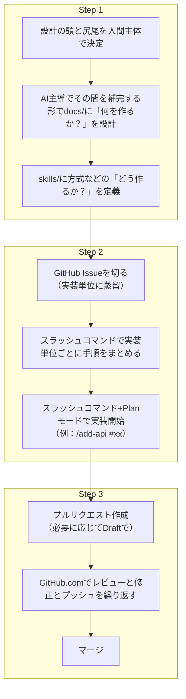

:::message
この記事は筆者がAI駆動開発を通して積み上げてきた開発フローやそのTipsを紹介するものであり、絶対的な正解を示したり、主義主張を押し付けたりするものではありません。
どこから始めたらよいかわからない方や指針を求めている方の参考になれば幸いです。
:::

この記事ではコーディングエージェントのことをAIと表記します。

## 前提："俺"の現状
### 使っているAIとツール
- GitHub Copilot（Enterprise）：仕事メイン
- Claude Code（Max）：プライベートメイン
- Codex（主にAzure OpenAIのモデルで利用）

メインはGitHub CopilotとClaude Codeです。本記事の内容もこの2つの最大公約数的な使い方になっています。
Codexはサブスクで常用できる環境がないので、かなり複雑な設計が必要な場面か、他ツール比較で確認したいときにスポットでAzure OpenAIのモデルと接続して使っています。
いずれの場合も開発プラットフォームはすべてGitHub.comです。

### AI駆動開発している場面
AI駆動開発を行うのは主に以下のような場面です。これらほとんどすべてのケースで今回紹介するフローを使っています。
- 本業：簡単なものからほぼ本番readyなサンプルコードまで
- 個人開発：個人開発とはいえプログラマ出身なのである程度ソフトウェアアーキテクチャは考えて作ることが多い
- ボランティアで手伝ってるNPOの開発：AIと一緒に1人で開発することが多い。現在は想定ユーザー数1.5万人規模のアプリを開発中

基本は1人での開発が多いので、企業で行われる開発のようにチーム開発を主眼にした話ではありません。しかし記事を振り返ってみると、特にチーム開発の時は使えないというものにはなっていないと思います。

## Step 1: 仕様駆動で始める（まずは設計書）
昨今ではAI駆動開発の標準となりつつある仕様駆動開発（その場のノリのVibe Codingではなく、ある程度仕様を決めてから実装に入る開発手法）ですが、"俺"も例に漏れず仕様駆動で始めます。

### 頭と尻尾は人間主導で決める
仕様駆動開発をどこから始めたら良いか分からない場合、GitHubの[Spec Kit](https://github.com/github/spec-kit)やAmazonが開発した[Kiro](https://kiro.dev/)は便利だと思います。しかし"俺"は使っていません。
多くのツールでは、人間が最初に「要件」や「つくりたいもの」をざっくり入力し、そこからAIがガイドして深掘りしながら仕様を詰めていく形が多いです。
ただ、このやり方はAIの思考と提案が散りやすいです。特に最近のReasoning系モデルは再帰的に思考できる分、任せすぎると話がどんどん重厚長大になっていくことがあります。


ではどうしているのかというと、画面-API-データベースというシンプルな3層構造のアプリケーションを作るとして、最初に「要件」と「データモデル（≒DB設計）」だけ人間が決めてしまいます。
この時点でAIを使うこともありますが、主体は人間です。100%人間の頭の中にある状態で、AIにアウトプットを手伝わせるイメージです。


このようにすることで間の画面やAPIの設計は両脇にガードレールが敷かれた状態でAIが提案してくれるため、ブレが少なくなると感じています。

### なにを作るか？はdocs配下でどう作るかはSkillで定義
仕様駆動開発によってできる設計書はプロジェクトのdocs/配下にMarkdown形式で保存する方式が多いです。この時に「どのような種類の設計書を作ればよいか？」という点が疑問に上がりますが、"俺"の場合は以下のようにしています。
- **docs/：何を作るか？を定義する**
    画面一覧 / API一覧 / データモデル一覧 / テスト仕様
- **skills/：どう作るか？を定義する**
    画面の実装方法 / APIの実装方法 / データアクセスの実装方法 / ルーティング方式 / テスト戦略

Skill作成のポイントはAIが知らないことや不確定なことを決定することのみに集中することです。たとえば社内開発サーバーの使い方やデータアクセス時に使用するORM処理の書き方などがそれにあたります。
簡単に言うと方式設計はSkillに定義するイメージです。例えばとあるプロジェクトのskillsディレクトリは以下のようになっています。

```
skills/
 ├── api-endpoint-add：APIエンドポイント実装のSkill
 ├── crud-screen-impl：CRUD画面実装のSkill
 ├── i18n-impl：多言語対応実装のSkill
 ├── screen-list-add：一覧画面実装のSkill
 ├── error-handling-improve：エラーハンドリング改善のSkill
 etc
```

補足：Claude CodeにはPlugins（Skillsを含むパッケージ配布の仕組み）と呼ばれるエコシステムがありますが、"俺"はデフォルトでマーケットプレイスが登録されているAnthropic公式Plugin以外は使っていません。基本的にはリポジトリ毎に自分でSkillを定義するか、MITライセンスのSkillを見つけて内容を理解した上で**リポジトリにコピペ**して使っています。
理由は大きく2点です。

- **どのプラグインでどのSkillが使われているか把握しづらく見通しが悪い**
    SkillsはどのようなSkillsが有効になっているかをシステムプロンプトに組み込むことで自動で呼び出しがされる仕組みです。逆に言うと無駄なSkillが多ければそれだけシステムプロンプトが肥大化し、AIの処理効率が落ちる可能性があります。
- **セキュリティ面での懸念がある**
    現状のエコシステム仕様では誰でもPluginを作成・公開し、コマンド1つで気軽にインストールできます。この簡便さを逆手にとって悪意のあるコードを実行させようとする攻撃手法が存在します。これについては公式ドキュメントにも注意喚起があり、もちろんすべてをちゃんとチェックして使えばいいのですが、現実的には難しいのでよほどの理由がない限りは公式以外のPluginは使わないようにしています。
    >If you must use a Skill from an untrusted or unknown source, exercise extreme caution and thoroughly audit it before use. Depending on what access Claude has when executing the Skill, malicious Skills could lead to data exfiltration, unauthorized system access, or other security risks.

    https://platform.claude.com/docs/en/agents-and-tools/agent-skills/overview#security-considerations


## Step 2: 実装を回す（Issue→Skills→スラッシュコマンド）
### Issueからはじめよ
さて、仕様が固まったら実装に入ります。ここで早速`設計書を見てxxx画面を実装して`と入力したいところですが、先に実装単位（APIや画面）でGitHub上にIssueを切ります。
Issueは人間が地道に作る必要はありません。`設計書から実装すべき画面やAPIを洗い出してIssueを作成してください。`とAIに指示すると、設計書をもとにIssueのタイトルと内容を生成してくれます。
メリットは主に以下の3つです。

- **実装タスクの永続化**
従来からdocs配下などでChecklist.mdのような形で実装タスクを管理する方法もありましたが、その方法は信用できません。マージという行為とチェックリスト更新が分離しているため、実装タスクが完了しても更新し忘れが起きます。通常のファイルとして更新する以上、誰がいつどのように更新したか？の履歴も追いづらいです。
一方、GitHubのIssueとして実装タスクを管理すれば、Issueのクローズがそのままタスク完了の証明になります。履歴もGitHub上で一元管理されます。

- **コンテキスト量のコントロール**
仮にAIに対して`設計書を見てxxx画面を実装して`と入力すると、AIは該当の部分を設計書から検索して取得しようとツールの利用を繰り返します。
そうするとコンテキスト量が肥大化し、上限に達したり、生成速度が遅くなったりする原因になります。（最近はSubAgentの登場で多少マシにはなりました）
そこで最初に一度Issueを切り、`Issue#xxの機能を実装して`と指示します。AIはまずIssueの内容だけをコンテキストとして取得すればよいので、コンテキスト量が少なくなる傾向にあります。
設計書から**実装単位に必要な情報のみを抽出する蒸留的なイメージ**をもつと分かりやすいです。

- **中央タスク管理**
AI駆動開発で目指すべきは生産性と品質の向上であり、AI縛り開発ではありません。場合によっては特定の機能を人間が実装したり、他の開発者に依頼したりすることもあります。開発後にバグが人間によって発見されることもあります。そのような場面において、人間とAIがコラボレーションしやすい環境を作るためにも、GitHubのIssueでタスク管理を一元化することは非常に有効です。さらにGitHub Copilotを利用している場合はCoding Agentと呼ばれる機能があり、IssueをCopilotにアサインするとCopilotが実装からプルリクエスト作成までクラウド上で自動で行ってくれる機能が使えるのもIssueで管理するモチベーションになります。
補足："俺"の場合はツールを複数使い分けることがあるため、コンテキストを特定のツールに依存させないようIssueベースに詰めておく、という意味合いもあります。


### スラッシュコマンドでSkillと実行ステップをまとめる
Skillには「どのように作るか」を技術要素としてまとめました。さらにスラッシュコマンドでそれらを束ねて「手順」にすると、開始が速くなります。
例えば以下のようなスラッシュコマンドを作成しています。

```
commands/
 ├── /add-api.md：API実装を開始する手順
 ├── /add-screen.md：画面実装を開始する手順
 ├── /impl-issue.md：バグなどIssueにある汎用的なタスク実装を開始する手順
 etc
```

```md:add-api.md
---
name: add-api
description: Add backend API and database access for specified functionality
---

# Add Backend API

指定された機能「$ARGUMENTS」に対するバックエンドのAPIと必要に応じてDBアクセスを実装します。

## 📋 活用するSkills

以下のSkillsを参照して実装してください：

- **db-table-add**: データベーステーブル追加、マイグレーションプラクティス
- **modern-csharp-coding-standards**: C# 14 + .NET 10 プラクティス
- **i18n-impl**: 多言語対応実装プラクティス
- **error-handling-improve**: エラーハンドリング改善プラクティス

## 🔄 実装手順
### Step 0: 設計書の確認ブランチの作成**
   - `feature/{issue番号}-{機能名}` 形式でブランチを作成
   - Git Worktreeを使用する場合は指示に従う

### Step 1: 設計書の確認
...対象によって異なるため省略...
### Step 2: 実装
...対象によって異なるため省略...
### Step 3: ビルドとテスト
...対象によって異なるため省略...
### Step 4: セルフレビュー
   - `/review` コマンドを使用してコードレビュー
   - 指摘事項があれば修正
### Step 5: プルリクエストの作成
   - PRテンプレートに従って作成
   - Test planにテスト実行結果を記載
   - プルリクエストのURLをユーザーに返す

```

このようなスラッシュコマンドを設定しておけば`/add-api #56`を打つだけで#56で定義されたAPIの実装が始まります。
スラッシュコマンド実行は**すべてPlanモードに設定して開始**することを強くお勧めします。

### 最初の「型」は人間が手厚くガイドする
どれだけ設計書やSkillsがしっかりしていても、コーディングエージェントは既存のコードを参考に考えてしまいます。ここは避けられません。つまり、既存のコードがよければよいコードが生成されるし、既存のコードが悪ければ悪いコードが生成されます。だから同じようなコードの最初の型だけは、人間がかなりフィードバックを繰り返して細かいところまでガイドします。Planモードで実装計画を作り、実装後もフィードバックを繰り返して良い型にします。
最初はここが面倒くさいところですが、一度良い型ができれば、あとはAIが良いコードを出してくれることが多いです。長期的には楽になります。

## Step 3: PRで仕上げる（レビューとCI）
### レビューはGitHub.com上で
スラッシュコマンドの定義からもわかる通り、"俺"はローカル開発をする場合でもローカルでレビューはせずリモートにPushしてプルリクエストを作成させています。

理由は2つです。
- **プルリク画面の方がレビューしやすい**
    GitHubのプルリクエスト画面は差分表示やコメント機能が充実していて、レビュー効率が高いです。特に「Viewed」チェックボックスでレビュー済み箇所を管理できる点がお気に入りです。
    今はやっていませんが、AIが実装したものを複数人で議論するなら、なおさらプルリクエスト画面が前提になります。なのでプルリクは常に最新に保つのが良いと思っています。

- **Worktreeを使っている場合ローカルでレビューするのが大変**
    最近は並列AI駆動開発としてGit Worktreeを使うことが多いです。しかしWorktree対応のGit管理アプリが少なく、ローカルでレビューするのがつらいです。
    GitHub Desktopを使っていますが、Git Worktreeに完全対応ではありません。
    なので最初からプルリクエスト画面で「1 Worktree = 1プルリクエスト」にしてレビューした方が楽、という判断です。

### プルリクエストはDraftで作成
そのように実装してそのままプルリクエストを作成させる場合、Draftでのプルリクエスト作成が有効な場合があります。
- 複数人で開発している時/レビュアーがAIのドライバー以外の時
    レビューがreadyなのかどうかの合図になります。

- CI/CDが設定されている時
    CI/CDパイプラインによって、プルリクエストをトリガーに自動ビルドを走らせ、成功した場合のみマージできるようにしているケースがあります。この状態で気軽にAIと対話するたびにpushしてしまうと、プルリクが更新されて自動ビルドが大量に走ってしまいます。
    Draft中は自動ビルドを走らせないようにしておくと、GitHub Actionsの無駄遣いを防止できます。GitHub Actionsでは`if: github.event.pull_request.draft == false`でドラフトかどうか判定して実際のビルド処理をスキップできます。

## まとめ
というわけで一通り"俺"のAI駆動開発フローを紹介しました。開発フローを図にするとこんな感じです。



また、ファイルツリーはこんな感じになります。
GitHub CopilotとClaude Codeを併用するなら設定ファイルは二重持ちになります。ただ、参照は寄せられます（例: GitHub CopilotのPromptsからClaudeディレクトリのskillsを参照）。

```
my-aidd-project/
 ├── .github/
 │    ├── skills/   # GitHub Copilot用Skills（どう作るか？）
 │    └── prompts/  # GitHub Copilot用プロンプト(スラッシュコマンド)（手順定義）
 ├── .claude/       
 │    ├── skills/   # Claude用Skills（どう作るか？）
 │    └── commands/ # Claude用スラッシュコマンド（手順定義）
 ├── docs/          # 設計書（何を作るか？）
 ├── src/           # ソースコード
```


### FAQ
最後に、よくありそうな質問に答える形で記事を締めくくります。
**Q1. カスタムエージェントは使わないの？**
A1. まだ刺さる使いどころが定まっていないのと、素の状態で結構賢いので、エージェントレイヤーをカスタムしたいモチベーションがあまりなく、現状は使っていません。

**Q2. 本当にスラッシュコマンドだけで開発できるの？**
A2. ほぼできるが技術や何を作るかによります。例えばC#でWeb APIを作る場合はほぼスラッシュコマンドだけでできるが、フロントエンドはまだまだ人間の細かい調整が必要なことが多いです。ここはAIの問題というよりもコンテキストが不足していることが多く、インタラクションや動的表示切り替えなどのUI特有の要素をAIに理解させるのが難しいためという感触です。Figma MCPサーバーを使ってUI設計書を連携させたりしてみたこともありますが、Figmaをめっちゃまじめに作ってないとあまり効果が感じられませんでした。また、スマートフォンアプリなどはエミュレーターや実機での環境依存なテストがどうしても人手が多く必要になります。

**Q3. もしAIとの対話の中で設計が変わったりしたらdocs配下はどうする？**
A3. 設計書を中間ファイルとして扱うのか、最終成果物として扱うのかによって変わります。前者であれば無視してIssueを最新の状態にすればいいですが、後者であることが多いので、Skillなどに実装が変わったら設計書の該当箇所も直す指示を入れています。
またスラッシュコマンドで/check-docs-integrityのようなコマンドで設計書と実装の整合性をチェックするコマンドを用意しておくという手もあります。いずれにせよ、設計書修正が必要になった場合に確実かつ効果的に修正できるようにdocsでは「なにを」作るかに集中してdocs自体もあまり肥大化しないように意識しています。

**Q4. 本当に全てのプロジェクトでこのフローやってるの？**
A4. ほぼやっています。ただし求める品質と使える時間によって細かな濃淡はあります。よく濃淡がつく例としてはテストで、軽くでよい場合はテスト戦略の方向性だけ始めにつくって、個々のケースはAIに任せてレビュー段階でカバレッジを確認します。逆に品質を重視する場合は設計時点でテスト仕様をテストケースレベル詳細に作り込み、AIにもそれに従ってテストコードを実装させます。

**Q5. MCPは使わないの？**
A5. Figma MCPやChrome DevTools MCPなど、MCPの特性を生かして動的にコンテキスト注入する価値があるものは使用することがあります。MCPも機能自体は便利なのですが、Skillsと同じく公式以外はどのようなセキュリティホールがあるかわからないので、明確なメリットと安全性が担保されない限りは無闇に使わないようにしています。


というわけで2026年1月時点での"俺"のAI駆動開発フローの紹介でした。
それでは、良いAI駆動開発ライフを！