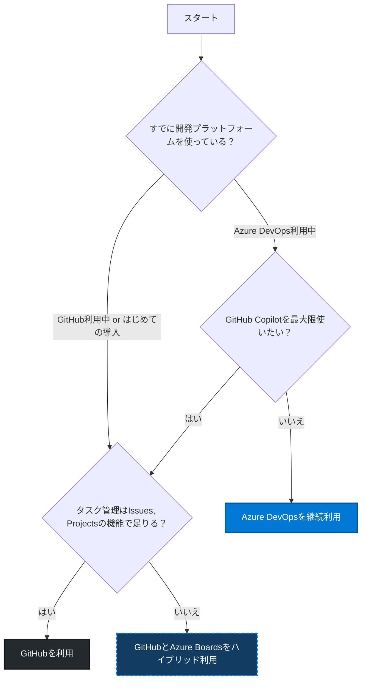

Microsoftが提供している開発プラットフォームの「Azure DevOps」と「GitHub」ですが、まれにどちらを選ぶべきか質問を受けることがあります。
この記事では私の考えとそれぞれの製品の強みを踏まえて、どのような観点で選択すればよいかをフローチャート形式で示してみます。

この記事の内容がすべての観点を網羅しているわけではありませんが、私の経験上ほとんどのケースでは以下のフローに沿って考えることが多いです。
追加の観点などがあればぜひコメントなどで教えてください。

:::message
Azure DevOps、GitHubともにオンプレミス版のAzure DevOps ServerやGitHub Enterprise Serverがありますが、それらを選択する場合は「ソースコードを社外に置きたくない」などの明確な理由がある場合が多く、判断に迷うことはあまりありません。
そのため、この記事ではいずれの製品もクラウド版を前提としています。
:::

### ポイント
上記のフローチャートを見ていく上でいくつかのポイントを解説します。

### Azure DevOpsよりはGitHubの方が投資対象になりやすい。
Microsoftが両方の製品をサポートしている以上、大々的に「Azure DevOpsをやめてGitHubを使ってください」とガイドをすることはもちろんありませんが、製品のアップデートや各種ドキュメントなどから比較的GitHubの方が優先的に開発投資されていることがうかがえます。
例えばGitHub Advanced Security (GHAS) のほうが、Azure DevOps 向けの同等機能（GitHub Advanced Security for Azure DevOps, GHAzDO）よりも先行して機能が提供されていますし、今を賑わせるAIコーディングエージェントもGitHubはGitHub Copilotの製品名でリリースしていますが、Azure DevOpsでの同等の機能は提供されていません。

DevOps製品戦略を記したMicrosoftのドキュメント「[Resources for DevOps](https://microsoft.github.io/PartnerResources/skilling/developer-velocity-academy/resources/devops?utm_source=chatgpt.com)」でも以下のような記述があります。
> Our strategy is to bring the best of both products together into a single product experience - in GitHub - to provide the broadest set of software development capabilities that meet the needs of every developer and enterprise.
> （拙訳：当社の戦略は、GitHub で両方の製品の最高のものを 1 つの製品エクスペリエンスに統合し、すべての開発者と企業のニーズを満たす最も広範なソフトウェア開発機能を提供することです。）

#### GitHub Copilotを効果的に使いたい場合はGitHubを選ぶ
GitHub CopilotはGitHubに統合されているAIコーディングエージェントです。
いままではCopilotの名前の通り、開発者と共にIDE上でコーディングをすることを基本的な製品スタイルとしてきました。この段階ではどこにソースコードが置かれていてもIDE上でコーディングするため大きな課題にはなりませんでした。
しかし、2025年に入って「GitHub Coding Agent」という新しい機能が登場し、GitHub上でほぼ全自動のAIコーディングが可能になりました。
このGitHub Coding AgentはGitHub上でIssuesをCopilotにアサインすることで、コードの追加や修正、Pull Requestの作成までを自動化することができます。
この機能は内部的にGitHub Actionsのランナーを使って動作しており、GitHub上で動作する仕組みになっています。

### タスク管理はAzure DevOpsのAzure Boardsの方が高機能
GitHubにもIssuesやProjectsの機能があり、簡単なタスク管理であれば十分に対応できます。
しかし、より高度なタスク管理を行いたい場合は現状Azure DevOpsに含まれるAzure Boardsの方が高機能です。
例えば、以下のような機能が必要な場合はAzure Boardsを選択することをお勧めします。
- カスタムクエリとダッシュボードの作成
- カスタムフィールドの利用
- 開発プロセスに準拠したタスクの階層管理
- チームのキャパシティ管理やスプリント計画

MicrosoftのドキュメントでもGitHubとAzure Boardsのハイブリッド利用ガイドを出しています。
https://developer.microsoft.com/blog/getting-the-most-out-of-azure-devops-and-github?utm_source=chatgpt.com

ちなみにAzure DevOpsにはAzure Boardsの他にAzure Repos, Azure Pipelines, Azure Test Plans, Azure Artifactsなどの機能があり、これらを選択して使う、使わないを決めることができます。詳しくは拙著の以下を参照してください。
https://zenn.dev/microsoft/articles/azure-devops-most-basic-of-basics

### Git LFSを使う場合はAzure DevOpsの方が有利
かなり細かいのでフローチャートからは省略しましたが、Git LFSを使う場合はAzure DevOpsの方が有利です。Git LFSはGit Large File Storageの略で、Gitで管理するには大きすぎるバイナリファイルを効率的に管理するための仕組みです。

GitHubでGit LFSを使う場合、プランに応じて10〜250GiBのストレージが提供されますが、追加でストレージを購入する場合は有償になります。([ソース](https://docs.github.com/ja/billing/concepts/product-billing/git-lfs#git-lfs-%E3%81%AE%E7%84%A1%E6%96%99%E4%BD%BF%E7%94%A8))

一方Azure DevOpsの場合、「Git LFS は、Azure DevOps Services で完全にサポートされ、無料です」とドキュメントに明記されています。（[ソース](https://learn.microsoft.com/ja-jp/azure/devops/repos/git/manage-large-files?view=azure-devops&utm_source=chatgpt.com#benefits)）

そのため、大きなバイナリファイルを大量に管理する場合はAzure DevOpsを選択することをお勧めします。（ただし「[Git で大きなファイルを管理および格納する](https://learn.microsoft.com/ja-jp/azure/devops/repos/git/manage-large-files?view=azure-devops&utm_source=chatgpt.com)」にある通り、どうやったらLFSを使わずに済むかを考えることも重要です）
