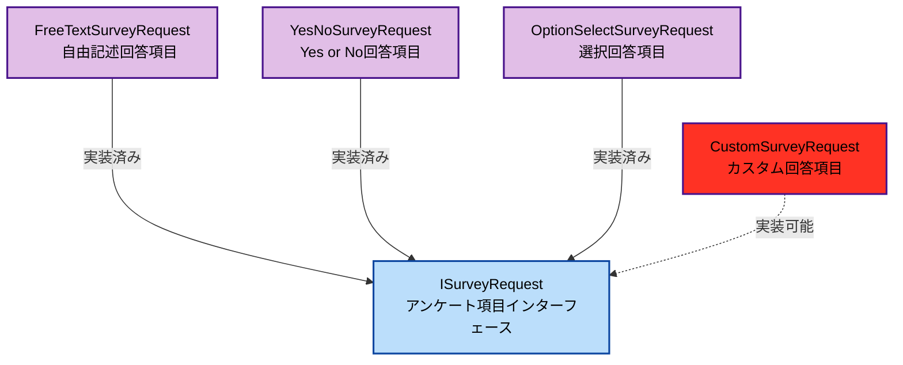

## Nemotron-Personas-Japan
NVIDIAは2025年9月23日に、合成的に生成されたペルソナのオープンソースデータセット「Nemotron-Personas-Japan」を公開しました。
このデータセットには、以下のような特徴があります。
- 実世界の日本における人口統計、地理的分布、性格特性の分布に基づいて合成的に生成された100万人分のペルソナデータ
- 日本語で記載されているペルソナデータ
- Creative Commons Attribution 4.0 International License (CC-BY-4.0)に基づいて提供され、商用利用も可能
- 18歳未満のデータは含まれていないため注意

ペルソナのサンプルデータ（一部抜粋）
```
Age : 57
Sex : "女"
Country : "日本"
Region : "中部地方"
Prefecture : "愛知県"
MaritalStatus : "既婚"
Occupation : "農業"
EducationLevel : "短大卒"
ArtsPersona : "畑山 櫻は水彩で季節の畑風景を描くことを創造的表現とし、地元劇団の朗読舞台で地域の伝統物語を語る際に、抽象的概念と具体的色彩を融合させて高い開放性と感情表現の豊かさを作品に込めている。"
CareerGoalsAndAmbitions : "自家産の野菜や果物をブランド化し、地域の観光農園として魅力を高めることで、次世代に農業と地域貢献の価値を継承したいと考えている。"
CulinaryPersona : "畑山 櫻は自家産トマトと季節の葉物を使った冷製パスタと、祭りで提供される甘酒割りのレシピを開発し、食材の見た目と味の改善を土壌の栄養管理と結びつけて、味覚と感覚の調和を追求する料理探求者である。"
CulturalBackground : "愛知県の中部地方の農村で育ち、地元の祭りや盆踊に参加しながら、地域コミュニティへの貢献を重視する姿勢が根付いている。"
HobbiesAndInterests : "絵画や水彩で自然の風景を描くこと、地元の劇団で朗読や舞台に参加し人と交流すること、季節ごとの盆踊や祭りの準備で体を動かすことに楽しみを見出す。"
Persona : "畑山 櫻は地域コミュニティと祭りを軸に、創造的な農業経営と柔軟な資金運用を融合させた感受性豊かな57歳の実践者である。"
ProfessionalPersona : "畑山 櫻は57歳の農業経営者で、地域の祭りで盆踊の指導役を務めつつ、スマートフォンで作業記録とSNS発信を統合し、自家産野菜のブランド化と観光農園化を戦略的に推進するビジネスプランを描いている。"
SkillsAndExpertise : "農業経営と土壌分析に長年の経験があり、スマートフォンを活用した作業記録やSNSでの情報発信も行う。農産物の見た目や味の改善を追求しつつ、地域の人々へのサービス精神でボランティア活動にも積極的に関わる。"
SportsPersona : "畑山 欻は地域の祭りで担ぎ手とともにリズムに合わせて体を伸ばす盆踊の練習を筋力トレーニングと位置付け、柔軟性と瞬発力の向上を目指しつつ、競技志向の仲間とスコアを競い合うことで外向性と競争性を同時に満たすスポーツアプローチを取っている。"
```

https://huggingface.co/datasets/nvidia/Nemotron-Personas-Japan

特に、実際の属性分布に基づいている点から、これを活用することで現実に近いアンケート調査を仮想的に実施できるのではないかと考えます。

## LLMでペルソナを再現することが可能か
前提として、LLMの学習データは現実世界の母集団属性の分布を正確に反映しているわけではありません。つまり、素のLLMに対してアンケートを実施した場合、その結果の分布はLLMの学習データに依存します。

しかし、先行論文である「Cultural Conditioning or Placebo? On the Effectiveness of Socio-Demographic Prompting」や「Simulating Human Opinions with Large Language Models: Opportunities and Challenges for Personalized Survey Data Modeling」は特定のペルソナの情報をプロンプトに含めることで、そのペルソナの属性に基づいてLLMの回答が有意に変化することを示唆しています。

https://arxiv.org/pdf/2406.11661

https://dl.acm.org/doi/abs/10.1145/3708319.3733685

もちろん、ペルソナデータのコンテキスト量には限りがあるため、実在の人間と100%同じ回答になるわけではありません。しかし、ある程度の傾向が把握できれば十分なケースや、実世界でアンケート調査を行う前段階のPreliminary Studyとしては有用ではないかと考えます。


以前、ペルソナを定義してLLMに正解のない決断をさせ、多数決を取る合議制AIを紹介しましたが、今回はこれを単純なアンケートという形で実装してみます。
https://zenn.dev/microsoft/articles/llm-magi-system


## Azure OpenAIバッチ処理を使って大規模並列推論を実行
今回のケースでは、すべてのペルソナに対してアンケートを実施しようとすると、最大で100万回の推論が必要になります。これを1回ずつChatCompletionで実行するのは現実的ではないため、Azure OpenAIのバッチ機能を使って大規模並列推論を行います。
バッチ機能はその名の通り、Azure OpenAIへの推論をバッチ処理で実行できる機能です。ChatCompletionのように数秒で返ってくるわけではなく、最大24時間程度かかる場合もありますが、数千から数万のリクエストを一括で処理でき、利用単価もChatCompletionの約50%のコストで実行できるため、低速でも問題ない大量の推論を実行する場合に適しています。

参考（公式ドキュメント）：[Azure OpenAI Batch デプロイの入門](https://learn.microsoft.com/ja-jp/azure/ai-foundry/openai/how-to/batch?tabs=global-batch%2Cstandard-input%2Cpython-secure&pivots=rest-api)


.NET SDKを使ったバッチ処理の実装例は以下の記事にまとめていますので、必要に応じてご参照ください。
https://zenn.dev/microsoft/articles/azure-openai-batch-dotnet

## 実装例
いつものように、完全に動作するC#のサンプルコードを以下のリポジトリに掲載しています。
https://github.com/07JP27/NvidiaPersonasJapanDataVirtualSurvey

ここではポイントのみ解説します。

### データローダー
今回のデータセットをPythonで読み込む場合、
```python
from datasets import load_dataset
nemotron_personas = load_dataset("nvidia/Nemotron-Personas-Japan", "train")
```
でデータの読み込みが完了しますが、.NETには同等のメソッドがないため、Hugging FaceのAPIを直接呼び出してParquetファイルをダウンロードし、Parquet.Netで読み込むデータローダーを実装しました。`LoadAsync`メソッドの引数にサンプリング数を指定することで、ランダムにペルソナデータを指定数分だけ取得できます。
https://github.com/07JP27/NvidiaPersonasJapanDataVirtualSurvey/blob/main/NvidiaPersonasJapanDataVirtualSurvey.Core/DataLoader.cs

### アンケート項目
アンケートは回答形式がさまざまです。それらの形式をロジックで場合分けして実装するのは大変なので、アンケート項目の`ISurveyRequest`インターフェースを定義し、各回答形式ごとにクラスを分けて実装する形にしました。具体的には、それぞれのアンケート項目クラスの中でシステムプロンプトとユーザープロンプトを生成するメソッドを実装し、それをバッチ処理の入力に使用します。ロジック側ではプロンプトを取得してバッチ処理に投げるだけでよく、アンケート項目の追加や変更も容易になります。



例えば選択回答式の`OptionSelectSurveyRequest`クラスは以下のように実装しています。
https://github.com/07JP27/NvidiaPersonasJapanDataVirtualSurvey/blob/main/NvidiaPersonasJapanDataVirtualSurvey.Core/Models/OptionSelectSurveyRequest.cs


### アンケートの実施
少し雑なコードですが、ライブラリ化してあるので以下のような簡単な呼び出しで実施できます。
1. SurveyServiceを初期化するとともにサンプリングされたアンケート対象のペルソナデータをピックアップ
2. アンケートの項目を定義
3. アンケートを実施し、バッチ処理の完了を待つ
4. 戻り値として結果を取得

```csharp
var service = await SurveyService.CreateAsync(batchClient, fileClient, deploymentName, 5, new Progress<string>(OnProgressChanged));
var request = new FreeTextSurveyRequest("昨今のAI(LLM)の目覚ましい進化についてどう思いますか？", 300);
var result = await service.RunSurveyAsync(request);
```
GitHubのサンプルコードではコンソールアプリとしてライブラリ呼び出しを実装しています。
https://github.com/07JP27/NvidiaPersonasJapanDataVirtualSurvey/blob/main/NvidiaPersonasJapanDataVirtualSurvey.Console/Program.cs


## アンケートの結果
### 自由記述

```csharp
var request = new FreeTextSurveyRequest("昨今のAI(LLM)の目覚ましい進化についてどう思いますか？", 300);
```

:::details アンケート結果を見る
Total Prompt Tokens: 10940
Total Completion Tokens: 2032
Total Tokens: 12972

43歳 / 女 / 卸売業 中小 / 東京都 在住
Answer: AI、特にLLMの発展には日々驚かされます。業務上、発注書の作成や在庫管理でデータ集計を自動化できるようになれば、作業効率が大きく向上しそうですね。ただ、電話や取引先との微妙なやり取りなど、人の経験と気配りが重要な場面はまだまだあります。私自身、現場感覚や細やかな調整力が持ち味なので、AIに頼りつつも、自分の強みもしっかり磨いていきたいです。公園散歩のルート提案など、個人の趣味にもAIが寄り添ってくれる将来も少し期待しちゃいます。
----------------------
50歳 / 男 / 金属製品製造業 中小 / 滋賀県 在住
Answer: AI、特にLLM（大規模言語モデル）の急速な進化には本当に驚かされますね。私の現場でも、IoTセンサーのログ分析やデータ管理にAIのアルゴリズムを取り入れる場面が増え、些細な変化や異常を瞬時に検知できるようになっています。本当に、まるで太鼓のビートの変化を敏感に聞き分ける職人のようです。

ただ、AIが進化する中で「人がどこまで創造的介在を保てるか」「現場での直感と機械的予測のリズムをどう調和させるか」が課題だと思います。自動化が進むほど、現場の人間の感性――光沢や手ざわり、現場の協調のビート――を意識的に織り込むことで、より豊かなものづくりの文化や新しい働き方に昇華できるのではと思います。AIはあくまでリズムのパートナー、我々はそのビートに責任と創造を乗せる役目ですね。
----------------------
50歳 / 女 / 病院 中堅 / 福岡県 在住
Answer: AI、とくにLLM（大規模言語モデル）の進化は、医療をはじめ多くの分野で「現場の運営」に大きな変化をもたらしていると感じます。私自身、病院内で電子カルテの自動入力補助や医療データ分析にLLMを試験的に活用してみて、人手や時間の短縮効果に驚きました。一方で、地方や高齢者の医療現場ではITリテラシー格差が残っていることも痛感しています。だからこそ、現場の声や地域性を反映しながら、AIを基盤にしたシステム設計やスタッフ研修を続け、テクノロジーと人の橋渡し役を担いたいという気持ちが強いです。慎重さと柔軟性のバランス、これが今後ますます重要になると思いますね。
----------------------
76歳 / 男 / 鉄鋼業 中小 (現在は引退) / 広島県 在住
Answer: AIの進化は、わしの現場感覚から見ても目を見張るものがあるのお。わしらが若い頃は、現場の知恵や経験が先輩から直接伝わるのが当たり前じゃったが、今は知識やノウハウもAIの力で手軽に調べられる時代になった。しかし、AIはあくまで補助であり、現場の空気や細かな勘どころ、危険予知まではまだ人間の感性の領域じゃと感じる。うまく使えば業務の効率化や安全管理に役立つじゃろうが、若いもんにはAI頼りにせず、現場で身体を使って学ぶことも忘れんで欲しいのう。技術と人の心、両方大事にせんといけんと、しみじみ思うわい。
----------------------
65歳 / 女 / 高等学校 中堅 (現在は引退) / 神奈川県 在住
Answer: AI、特に大規模言語モデル（LLM）の進化には、正直なところ驚きと期待を感じております。私自身、長年教育の現場に携わってまいりましたが、AIの存在は学びの形を大きく広げてくれる可能性があります。たとえば、デジタルリテラシー講座でも高齢の方が文章作成や質問応答でAIを活用できれば、知的自律の一助になります。もっとも、情報の信頼性や人間らしさを保つ工夫も必要かと存じます。AIを活用しつつ、本質的な「人と人との学び」の価値を見失わないよう、バランスを大切にしていきたいですね。
----------------------
53歳 / 女 / 高等学校 中堅 / 埼玉県 在住
Answer: AI、特にLLMの進化には日々驚かされます。授業計画や教材開発、校内の業務改善にも役立つ可能性が高く、私自身も最近は評価設計や生徒相談の際に、データの整理やアイデア出しで活用し始めました。ただ、教育現場ですぐに全面導入できるかは慎重に考えています。AIと人間の協働が、教員の負担軽減や生徒へのきめ細やかな指導につながる一方で、倫理や情報管理、個々の生徒への対応力には、依然として人の目と感性が不可欠です。校内のICT活用指導にも力を入れ、持続的な学びの質向上につなげたいです。
----------------------
51歳 / 女 / 助産 大手 / 愛知県 在住
Answer: AI、特に大規模言語モデル（LLM）の進化は、医療現場にも新しい可能性をもたらしていると感じます。私たち助産の現場でも、電子カルテ記録や患者さんへの情報提供、スタッフ教育の効率化に活用できる部分が増えてきました。ただ、導入には現場ニーズとの丁寧なすり合わせや、個人情報の管理、そしてスタッフ全員が無理なく使いこなせる教育体制の整備が欠かせません。伝統的なコミュニケーションや現場の知恵とAIをバランス良く融合することで、より持続可能な周産期ケアにつながると期待しています。今後も新しい技術の動向にアンテナを張り、地域性や職人精神を生かした独自の活用方法を探っていきたいですね。
----------------------
82歳 / 女 / 小売業 中小 / 大阪府 在住
Answer: 確かに、AIの進化はほんまにすごい時代になったなぁと感じます。私らが若い頃は、手書きの帳簿や、そろばん弾いて在庫数えたりしてたもんです。それが今や、AIが文章作成も計算も、お客さんの悩み相談まで応えてくれるって…まるで夢みたいです。ただ、その進歩がええ面ばかりでなく、仕事のやりがいや人と人との温かい交流も減ってまうんちゃうかなと、ちょっと心配もあります。なんでもAIに頼りすぎず、人間らしいぬくもりも忘れずに大事にしていきたいですね。
----------------------
66歳 / 男 / 卸売業 中堅 (現在は引退) / 東京都 在住
Answer: AI――特に言語モデル（LLM）の進化には、私自身、大きな可能性と同時に少しばかりの慎重さを感じています。物流や在庫管理の現場でも、AIによるデータ分析や業務効率化は確かに大きな力です。その一方で、人と人とのつながりや、地域社会に根差した知恵こそが継続的な発展の土台だという信念も持っています。便利になる一方、機械的なやり取りだけでは見逃されがちな細かな気遣いや共感も、私たちシニア世代がしっかり伝えていきたい。AIを活かしつつ、人間らしさを守るバランスが大切だと考えます。
----------------------
62歳 / 男 / 介護福祉業 中堅 / 東京都 在住
Answer: AI、特にLLM（大規模言語モデル）の進化については、介護現場にも様々な可能性が開かれてきたなと実感しています。記録作業の効率化、認知症の方とのコミュニケーション補助など、実務の省力化に役立つ一方、現場の温もりや個人の思いに寄り添う部分は人間ならではだとも感じます。新技術は常にリスクもあるので、導入には慎重さが必要ですが、うまく活用すれば地域の高齢者支援にも持続可能性をもたらすはず。私は現場と経営のバランスを取りつつ、チームとともに最新技術の実践的な応用を模索したいですね。
----------------------
:::


### Yes/No回答

```csharp
var request = new YesNoSurveyRequest("現在の日本において金融緩和政策は必要だと思いますか？");
```
:::details アンケート結果を見る
Total Prompt Tokens: 6163
Total Completion Tokens: 10
Total Tokens: 6173

65歳 / 女 / 介護福祉業 中堅 (現在は引退) / 大分県 在住
Answer: No
----------------------
69歳 / 女 / 介護福祉業 中堅 (現在は引退) / 京都府 在住
Answer: Yes
----------------------
66歳 / 女 / 小売業 中小 / 福岡県 在住
Answer: No
----------------------
19歳 / 女 / 食料品製造業 中堅 / 群馬県 在住
Answer: No
----------------------
29歳 / 女 / クリーニング業 中小 / 神奈川県 在住
Answer: Yes
----------------------
:::

### 選択回答

```csharp
var request = new OptionSelectSurveyRequest(
    "あなたが食べて見たいのはどちらですか？",
    new List<string> { "正統派芋煮", "庄内風芋煮" },
    isMultiSelect: false
);
```

:::details アンケート結果を見る
Total Prompt Tokens: 6558
Total Completion Tokens: 52
Total Tokens: 6610

67歳 / 女 / 土石製品製造業 中小 (現在は引退) / 岐阜県 在住
Answer: 2. 庄内風芋煮
----------------------
69歳 / 女 / 金融業 大手 (現在は引退) / 埼玉県 在住
Answer: 1. 正統派芋煮
----------------------
74歳 / 女 / 介護福祉業 大手 (現在は引退) / 静岡県 在住
Answer: 1. 正統派芋煮
----------------------
47歳 / 男 / 漁業 / 京都府 在住
Answer: 2. 庄内風芋煮
----------------------
21歳 / 男 / 学生 / 宮崎県 在住
Answer: 1. 正統派芋煮
----------------------
:::

## まとめ
LLMに人格を与えて希望の振るまいをさせる方法は、プロンプトエンジニアリングの黎明期からよく使われていた手法です。しかし、それを仮想アンケートなどに応用する場合、現実世界の属性分布とペルソナの分布を合致させる必要があり、なかなか実現が難しいものでした。今回NVIDIAが公開したペルソナオープンデータはその点をクリアしており、Azure OpenAIのバッチ機能と組み合わせることで大規模な仮想アンケート調査を実施できることを示しました。
利用トークン数から試算すると、今回の自由記述アンケートを全ペルソナ100万人に対して実行した場合、1回のアンケートあたり約15万円程度のコストで実施できる計算になります。実際のアンケート調査と比べて、圧倒的に低コストかつ迅速に実施できるため、事前調査や仮説検証などに有用な場面が多くあるのではないかと考えます。


## リポジトリ
ご興味がある方はぜひサンプルコードのリポジトリを覗いてみてください。
https://github.com/07JP27/NvidiaPersonasJapanDataVirtualSurvey

## 参考
https://huggingface.co/datasets/nvidia/Nemotron-Personas-Japan

https://arxiv.org/pdf/2406.11661

https://dl.acm.org/doi/abs/10.1145/3708319.3733685