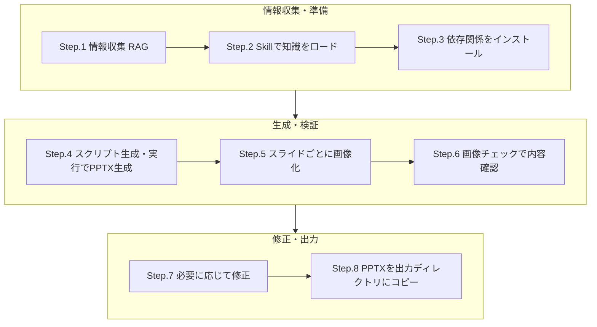

2026年2月5日にAnthropicから新しいフラグシップモデルであるClaude Opus4.6がリリースされました。
さまざまな新機能が搭載されていますが、その中でも特にSNSなどで注目されているのはPowerPointプレゼンテーションファイル(PPTX)を高品質に生成できる能力です。
ちょうど開発しているLLMアプリケーションにPPTX生成機能を組み込む予定があったため、Claude Opus4.6がどのようにPPTXファイルを生成しているのか、その技術的な背景と全体フローについて調査しながらまとめてみました。

----
**ちょっと宣伝**
Microsoft Azureで提供されるMicrosoft Foundryを使用すると、OpenAIとAnthropicの二大巨頭を含む11,000以上のモデルを1つのプラットフォームで利用できます。すでにClaude Opus4.6も利用可能(preview)です。

https://learn.microsoft.com/ja-jp/azure/ai-foundry/foundry-models/how-to/use-foundry-models-claude?view=foundry&preserve-view=true

----

実際に私がClaude Opus4.6にPPTX生成させた例を以下に示します。「直近で公開されたNTTの決算説明資料をPPTXで作って」という1文だけで右側のようなPPTXファイルが生成できました。


上記の画像の赤色で囲った部分を展開すると実際にClaude Opus4.6が動作したステップやスクリプトが確認できるので、これを元にPPTX生成の仕組みをひも解いていきます。


## はじめに（要点まとめ）
- Node.jsスクリプトを生成・実行してPPTXファイルを作成している
- 生成には[PptxGenJS](https://gitbrent.github.io/PptxGenJS/)というライブラリを使用している
- アイコンはreact-iconsライブラリを使用
- SkillでPPTX生成用の知識とPptxGenJSの使い方や検証方法を動的ロードしている
- 生成後にスライド1枚ごとに画像化してOpus4.6がチェックを行っている（リフレクション）


## 全体的な流れ



## 各ステップの詳細
### Step.1 情報収集（RAG）
はじめにFactとなる情報をRAG（Retrieval-Augmented Generation）で収集しています。
このフェーズは従来のモデルでも精度高く行われていました。

今回は検証のためにあえてFYを指定せずに「直近の」と指示していますが、いわゆる「Agentic Search」で繰り返し必要な情報収集を行い、最新の決算説明資料を見つけ出していることがわかります。体感ですが、Opus4.5に比べてOpus4.6の方が多段検索が強化されている印象です。華々しいアップデートの影にもこのような基礎となる部分の地道な改善があるのかもしれません。


### Step.2 SkillでPPTX生成用の知識とPptxGenJSの使い方をロード
情報収集が完了したところで、PPTX生成に必要な以下の知識を動的にロードしています。
- PPTX skill
    Anthropic公式が提供しているPPTX生成用のSkillを読み込んでいます。
    https://github.com/anthropics/skills/tree/main/skills/pptx

- PptxGenJS guide
    上記のSkillフォルダに含まれているPptxGenJSの使い方ガイドを読み込んでいます。
    https://github.com/anthropics/skills/blob/main/skills/pptx/pptxgenjs.md


### Step.3 生成に必要な依存関係をインストール
Skillを元に必要なライブラリをインストールしています。インストールしているライブラリは以下の通りです。
- pptxgenjs（PPTX生成ライブラリ）
- react / react-dom（アイコン生成用）
- react-icons（SVGアイコンセット）
- sharp（PNG変換用）


### Step.4 Node.jsスクリプトを生成&実行しPPTXを生成
Skillを元にOpus4.6がPPTX生成用のスクリプトを生成し、それを実行しています。


実際に生成&実行されたスクリプトの内容を以下に示します。
:::details PPTX生成スクリプト
````javascript
const pptxgen = require("pptxgenjs");

const pres = new pptxgen();
pres.layout = "LAYOUT_16x9";
pres.author = "NTT IR";
pres.title = "NTT 2025年度 第3四半期決算説明資料";

// ── Color Palette (NTT Corporate) ──
const C = {
  navy: "0C1D3A",
  blue: "0050A0",
  lightBlue: "2E7DC5",
  accent: "00A0E9",
  white: "FFFFFF",
  offWhite: "F0F4F8",
  lightGray: "E2E8F0",
  midGray: "94A3B8",
  darkGray: "334155",
  text: "1E293B",
  red: "DC2626",
  green: "16A34A",
  orange: "EA580C",
};

const makeShadow = () => ({ type: "outer", blur: 6, offset: 2, angle: 135, color: "000000", opacity: 0.12 });

// ═══════════════════════════════════════════════
// SLIDE 1 : Title Slide
// ═══════════════════════════════════════════════
{
  const s = pres.addSlide();
  s.background = { color: C.navy };

  // Accent bar at top
  s.addShape(pres.shapes.RECTANGLE, { x: 0, y: 0, w: 10, h: 0.06, fill: { color: C.accent } });

  // Title
  s.addText("2025年度 第3四半期\n決算について", {
    x: 0.8, y: 1.0, w: 8.4, h: 2.4,
    fontSize: 40, fontFace: "Calibri", color: C.white, bold: true,
    lineSpacingMultiple: 1.3, align: "left", valign: "middle", margin: 0,
  });

  // Subtitle
  s.addText("NTT株式会社", {
    x: 0.8, y: 3.5, w: 5, h: 0.5,
    fontSize: 22, fontFace: "Calibri", color: C.accent, bold: true, margin: 0,
  });

  // Date
  s.addText("2026年 2月 5日", {
    x: 0.8, y: 4.1, w: 5, h: 0.4,
    fontSize: 16, fontFace: "Calibri", color: C.midGray, margin: 0,
  });

  // Right side decorative shape
  s.addShape(pres.shapes.RECTANGLE, { x: 7.5, y: 0.06, w: 2.5, h: 5.565, fill: { color: C.blue, transparency: 40 } });
  s.addShape(pres.shapes.RECTANGLE, { x: 8.5, y: 0.06, w: 1.5, h: 5.565, fill: { color: C.accent, transparency: 30 } });

  // Footer
  s.addText("© NTT, Inc. 2026", {
    x: 0.8, y: 5.1, w: 4, h: 0.3,
    fontSize: 9, color: C.midGray, fontFace: "Calibri", margin: 0,
  });
}

// ═══════════════════════════════════════════════
// SLIDE 2 : Agenda
// ═══════════════════════════════════════════════
{
  const s = pres.addSlide();
  s.background = { color: C.offWhite };
  s.addShape(pres.shapes.RECTANGLE, { x: 0, y: 0, w: 10, h: 0.06, fill: { color: C.accent } });

  s.addText("目次", {
    x: 0.8, y: 0.4, w: 8.4, h: 0.7,
    fontSize: 32, fontFace: "Calibri", color: C.navy, bold: true, margin: 0,
  });

  const items = [
    { num: "1", title: "2025年度 第3四半期 連結決算概況" },
    { num: "2", title: "通期業績予想" },
    { num: "3", title: "トピックス" },
    { num: "4", title: "Appendix" },
  ];

  items.forEach((item, i) => {
    const yBase = 1.5 + i * 0.95;
    // Card bg
    s.addShape(pres.shapes.RECTANGLE, {
      x: 1.0, y: yBase, w: 8.0, h: 0.75,
      fill: { color: C.white }, shadow: makeShadow(),
    });
    // Number circle
    s.addShape(pres.shapes.OVAL, {
      x: 1.3, y: yBase + 0.12, w: 0.5, h: 0.5,
      fill: { color: C.blue },
    });
    s.addText(item.num, {
      x: 1.3, y: yBase + 0.12, w: 0.5, h: 0.5,
      fontSize: 18, fontFace: "Calibri", color: C.white, bold: true,
      align: "center", valign: "middle", margin: 0,
    });
    // Title text
    s.addText(item.title, {
      x: 2.1, y: yBase, w: 6.5, h: 0.75,
      fontSize: 18, fontFace: "Calibri", color: C.text, valign: "middle", margin: 0,
    });
  });
}

// ═══════════════════════════════════════════════
// SLIDE 3 : Section Divider - 連結決算概況
// ═══════════════════════════════════════════════
{
  const s = pres.addSlide();
  s.background = { color: C.blue };
  s.addShape(pres.shapes.RECTANGLE, { x: 0, y: 0, w: 10, h: 0.06, fill: { color: C.accent } });

  s.addText("01", {
    x: 0.8, y: 1.2, w: 2, h: 1,
    fontSize: 60, fontFace: "Calibri", color: C.accent, bold: true, margin: 0, 
  });
  s.addText("2025年度 第3四半期\n連結決算概況", {
    x: 0.8, y: 2.2, w: 8, h: 1.6,
    fontSize: 36, fontFace: "Calibri", color: C.white, bold: true, lineSpacingMultiple: 1.3, margin: 0,
  });
  s.addShape(pres.shapes.RECTANGLE, { x: 0.8, y: 4.0, w: 2, h: 0.05, fill: { color: C.accent } });
}

// ═══════════════════════════════════════════════
// SLIDE 4 : Key Financial Highlights
// ═══════════════════════════════════════════════
{
  const s = pres.addSlide();
  s.background = { color: C.offWhite };
  s.addShape(pres.shapes.RECTANGLE, { x: 0, y: 0, w: 10, h: 0.06, fill: { color: C.accent } });

  s.addText("第3四半期 連結決算の状況", {
    x: 0.8, y: 0.3, w: 8.4, h: 0.6,
    fontSize: 26, fontFace: "Calibri", color: C.navy, bold: true, margin: 0,
  });

  s.addText("対前年 増収・増益  |  営業収益は過去最高を更新", {
    x: 0.8, y: 0.9, w: 8.4, h: 0.4,
    fontSize: 14, fontFace: "Calibri", color: C.blue, bold: true, margin: 0,
  });

  const metrics = [
    { label: "営業収益", value: "10兆4,210億円", change: "+3.7%", color: C.green },
    { label: "EBITDA", value: "2兆6,573億円", change: "+4.1%", color: C.green },
    { label: "営業利益", value: "1兆4,571億円", change: "+4.1%", color: C.green },
    { label: "当期利益", value: "9,261億円", change: "+8.9%", color: C.green },
  ];

  metrics.forEach((m, i) => {
    const xBase = 0.5 + i * 2.3;
    const yBase = 1.6;

    s.addShape(pres.shapes.RECTANGLE, {
      x: xBase, y: yBase, w: 2.1, h: 2.8,
      fill: { color: C.white }, shadow: makeShadow(),
    });
    // Top accent
    s.addShape(pres.shapes.RECTANGLE, {
      x: xBase, y: yBase, w: 2.1, h: 0.06,
      fill: { color: C.accent },
    });
    // Label
    s.addText(m.label, {
      x: xBase, y: yBase + 0.25, w: 2.1, h: 0.4,
      fontSize: 14, fontFace: "Calibri", color: C.midGray, align: "center", margin: 0,
    });
    // Value
    s.addText(m.value, {
      x: xBase, y: yBase + 0.75, w: 2.1, h: 1.0,
      fontSize: 18, fontFace: "Calibri", color: C.text, bold: true, align: "center", valign: "middle", margin: 0,
    });
    // Change
    s.addShape(pres.shapes.RECTANGLE, {
      x: xBase + 0.4, y: yBase + 2.0, w: 1.3, h: 0.45,
      fill: { color: "DCFCE7" },
    });
    s.addText("▲ " + m.change, {
      x: xBase + 0.4, y: yBase + 2.0, w: 1.3, h: 0.45,
      fontSize: 15, fontFace: "Calibri", color: C.green, bold: true, align: "center", valign: "middle", margin: 0,
    });
  });

  // Note
  s.addText("※ 当期利益は当社に帰属する当期利益（非支配持分帰属分控除後）", {
    x: 0.8, y: 4.9, w: 8.4, h: 0.4,
    fontSize: 9, fontFace: "Calibri", color: C.midGray, margin: 0,
  });
}

// ═══════════════════════════════════════════════
// SLIDE 5 : Segment Performance
// ═══════════════════════════════════════════════
{
  const s = pres.addSlide();
  s.background = { color: C.offWhite };
  s.addShape(pres.shapes.RECTANGLE, { x: 0, y: 0, w: 10, h: 0.06, fill: { color: C.accent } });

  s.addText("セグメント別の状況", {
    x: 0.8, y: 0.3, w: 8.4, h: 0.6,
    fontSize: 26, fontFace: "Calibri", color: C.navy, bold: true, margin: 0,
  });

  // Revenue table
  const headerOpts = { fill: { color: C.blue }, color: C.white, bold: true, fontSize: 11, fontFace: "Calibri", align: "center", valign: "middle" };
  const cellOpts = { fontSize: 11, fontFace: "Calibri", align: "right", valign: "middle", color: C.text };
  const cellLeftOpts = { ...cellOpts, align: "left" };

  // Revenue section label
  s.addText("営業収益", {
    x: 0.8, y: 1.05, w: 2, h: 0.35,
    fontSize: 14, fontFace: "Calibri", color: C.blue, bold: true, margin: 0,
  });

  const revTable = [
    [
      { text: "セグメント", options: { ...headerOpts } },
      { text: "2025年度 3Q累計", options: { ...headerOpts } },
      { text: "対前年", options: { ...headerOpts } },
    ],
    [
      { text: "総合ICT事業", options: { ...cellLeftOpts } },
      { text: "46,597億円", options: { ...cellOpts } },
      { text: "+2,360億円", options: { ...cellOpts, color: C.green } },
    ],
    [
      { text: "地域通信事業", options: { ...cellLeftOpts } },
      { text: "23,467億円", options: { ...cellOpts } },
      { text: "+168億円", options: { ...cellOpts, color: C.green } },
    ],
    [
      { text: "グローバル・ソリューション事業", options: { ...cellLeftOpts } },
      { text: "36,438億円", options: { ...cellOpts } },
      { text: "+1,482億円", options: { ...cellOpts, color: C.green } },
    ],
    [
      { text: "その他（不動産・エネルギー等）", options: { ...cellLeftOpts } },
      { text: "12,184億円", options: { ...cellOpts } },
      { text: "+76億円", options: { ...cellOpts, color: C.green } },
    ],
  ];

  s.addTable(revTable, {
    x: 0.8, y: 1.45, w: 8.4, colW: [3.5, 2.5, 2.4],
    border: { pt: 0.5, color: C.lightGray },
    rowH: [0.35, 0.35, 0.35, 0.35, 0.35],
    autoPage: false,
  });

  // Operating income section
  s.addText("営業利益", {
    x: 0.8, y: 3.35, w: 2, h: 0.35,
    fontSize: 14, fontFace: "Calibri", color: C.blue, bold: true, margin: 0,
  });

  const opTable = [
    [
      { text: "セグメント", options: { ...headerOpts } },
      { text: "2025年度 3Q累計", options: { ...headerOpts } },
      { text: "対前年", options: { ...headerOpts } },
    ],
    [
      { text: "総合ICT事業", options: { ...cellLeftOpts } },
      { text: "7,454億円", options: { ...cellOpts } },
      { text: "-885億円", options: { ...cellOpts, color: C.red } },
    ],
    [
      { text: "地域通信事業", options: { ...cellLeftOpts } },
      { text: "3,032億円", options: { ...cellOpts } },
      { text: "+93億円", options: { ...cellOpts, color: C.green } },
    ],
    [
      { text: "グローバル・ソリューション事業", options: { ...cellLeftOpts } },
      { text: "3,842億円", options: { ...cellOpts } },
      { text: "+924億円", options: { ...cellOpts, color: C.green } },
    ],
    [
      { text: "その他（不動産・エネルギー等）", options: { ...cellLeftOpts } },
      { text: "547億円", options: { ...cellOpts } },
      { text: "+411億円", options: { ...cellOpts, color: C.green } },
    ],
  ];

  s.addTable(opTable, {
    x: 0.8, y: 3.75, w: 8.4, colW: [3.5, 2.5, 2.4],
    border: { pt: 0.5, color: C.lightGray },
    rowH: [0.35, 0.35, 0.35, 0.35, 0.35],
    autoPage: false,
  });
}

// ═══════════════════════════════════════════════
// SLIDE 6 : Section Divider - 通期業績予想
// ═══════════════════════════════════════════════
{
  const s = pres.addSlide();
  s.background = { color: C.blue };
  s.addShape(pres.shapes.RECTANGLE, { x: 0, y: 0, w: 10, h: 0.06, fill: { color: C.accent } });

  s.addText("02", {
    x: 0.8, y: 1.2, w: 2, h: 1,
    fontSize: 60, fontFace: "Calibri", color: C.accent, bold: true, margin: 0,
  });
  s.addText("通期業績予想", {
    x: 0.8, y: 2.2, w: 8, h: 1.2,
    fontSize: 36, fontFace: "Calibri", color: C.white, bold: true, margin: 0,
  });
  s.addShape(pres.shapes.RECTANGLE, { x: 0.8, y: 3.5, w: 2, h: 0.05, fill: { color: C.accent } });
}

// ═══════════════════════════════════════════════
// SLIDE 7 : Full Year Forecast (Revised)
// ═══════════════════════════════════════════════
{
  const s = pres.addSlide();
  s.background = { color: C.offWhite };
  s.addShape(pres.shapes.RECTANGLE, { x: 0, y: 0, w: 10, h: 0.06, fill: { color: C.accent } });

  s.addText("2025年度 通期業績予想（修正）", {
    x: 0.8, y: 0.3, w: 8.4, h: 0.6,
    fontSize: 26, fontFace: "Calibri", color: C.navy, bold: true, margin: 0,
  });

  s.addText("ドコモの顧客基盤強化施策加速・データグループのDC REIT化利益等を反映し下方修正", {
    x: 0.8, y: 0.9, w: 8.4, h: 0.4,
    fontSize: 12, fontFace: "Calibri", color: C.darkGray, margin: 0,
  });

  const hdr = { fill: { color: C.navy }, color: C.white, bold: true, fontSize: 11, fontFace: "Calibri", align: "center", valign: "middle" };
  const cell = { fontSize: 11, fontFace: "Calibri", align: "right", valign: "middle", color: C.text };
  const cellL = { ...cell, align: "left", bold: true };
  const cellRed = { ...cell, color: C.red, bold: true };

  const tbl = [
    [
      { text: "", options: hdr },
      { text: "当初予想\n(2025/5/9)", options: hdr },
      { text: "修正予想\n(2026/2/5)", options: hdr },
      { text: "差額", options: hdr },
    ],
    [
      { text: "営業収益", options: cellL },
      { text: "14兆1,900億円", options: cell },
      { text: "14兆1,640億円", options: cell },
      { text: "▲260億円", options: cellRed },
    ],
    [
      { text: "EBITDA", options: cellL },
      { text: "3兆3,900億円", options: cell },
      { text: "3兆2,800億円", options: cell },
      { text: "▲1,100億円", options: cellRed },
    ],
    [
      { text: "営業利益", options: cellL },
      { text: "1兆7,700億円", options: cell },
      { text: "1兆6,600億円", options: cell },
      { text: "▲1,100億円", options: cellRed },
    ],
    [
      { text: "当期利益", options: cellL },
      { text: "1兆400億円", options: cell },
      { text: "9,650億円", options: cell },
      { text: "▲750億円", options: cellRed },
    ],
  ];

  s.addTable(tbl, {
    x: 0.8, y: 1.5, w: 8.4, colW: [2.0, 2.2, 2.2, 2.0],
    border: { pt: 0.5, color: C.lightGray },
    rowH: [0.5, 0.45, 0.45, 0.45, 0.45],
    autoPage: false,
  });

  // Company breakdown
  s.addText("各社別 通期予想概要", {
    x: 0.8, y: 4.0, w: 4, h: 0.4,
    fontSize: 14, fontFace: "Calibri", color: C.blue, bold: true, margin: 0,
  });

  const compData = [
    ["ドコモ", "6兆3,360億円", "8,830億円", "▲830億円"],
    ["データグループ", "4兆9,107億円", "4,960億円", "▲260億円"],
    ["NTT東日本", "1兆6,700億円", "2,200億円", "—"],
    ["NTT西日本", "1兆4,720億円", "770億円", "—"],
  ];

  const tbl2 = [
    [
      { text: "", options: { ...hdr, fill: { color: C.blue } } },
      { text: "営業収益", options: { ...hdr, fill: { color: C.blue } } },
      { text: "営業利益", options: { ...hdr, fill: { color: C.blue } } },
      { text: "利益差額", options: { ...hdr, fill: { color: C.blue } } },
    ],
    ...compData.map(row => [
      { text: row[0], options: { ...cellL, fontSize: 10 } },
      { text: row[1], options: { ...cell, fontSize: 10 } },
      { text: row[2], options: { ...cell, fontSize: 10 } },
      { text: row[3], options: { ...cell, fontSize: 10, color: row[3].includes("▲") ? C.red : C.midGray } },
    ]),
  ];

  s.addTable(tbl2, {
    x: 0.8, y: 4.4, w: 8.4, colW: [2.0, 2.2, 2.2, 2.0],
    border: { pt: 0.5, color: C.lightGray },
    rowH: [0.3, 0.25, 0.25, 0.25, 0.25],
    autoPage: false,
  });
}

// ═══════════════════════════════════════════════
// SLIDE 8 : Section Divider - トピックス
// ═══════════════════════════════════════════════
{
  const s = pres.addSlide();
  s.background = { color: C.blue };
  s.addShape(pres.shapes.RECTANGLE, { x: 0, y: 0, w: 10, h: 0.06, fill: { color: C.accent } });

  s.addText("03", {
    x: 0.8, y: 1.2, w: 2, h: 1,
    fontSize: 60, fontFace: "Calibri", color: C.accent, bold: true, margin: 0,
  });
  s.addText("トピックス", {
    x: 0.8, y: 2.2, w: 8, h: 1.2,
    fontSize: 36, fontFace: "Calibri", color: C.white, bold: true, margin: 0,
  });
  s.addShape(pres.shapes.RECTANGLE, { x: 0.8, y: 3.5, w: 2, h: 0.05, fill: { color: C.accent } });
}

// ═══════════════════════════════════════════════
// SLIDE 9 : IOWN / 光電融合デバイス
// ═══════════════════════════════════════════════
{
  const s = pres.addSlide();
  s.background = { color: C.offWhite };
  s.addShape(pres.shapes.RECTANGLE, { x: 0, y: 0, w: 10, h: 0.06, fill: { color: C.accent } });

  s.addText("① 光電融合デバイスの量産化", {
    x: 0.8, y: 0.3, w: 8.4, h: 0.6,
    fontSize: 24, fontFace: "Calibri", color: C.navy, bold: true, margin: 0,
  });

  // Left card
  s.addShape(pres.shapes.RECTANGLE, {
    x: 0.5, y: 1.15, w: 4.3, h: 3.8,
    fill: { color: C.white }, shadow: makeShadow(),
  });
  s.addShape(pres.shapes.RECTANGLE, {
    x: 0.5, y: 1.15, w: 4.3, h: 0.06,
    fill: { color: C.accent },
  });

  s.addText("IOWN光コンピューティング商用化", {
    x: 0.8, y: 1.4, w: 3.8, h: 0.4,
    fontSize: 14, fontFace: "Calibri", color: C.blue, bold: true, margin: 0,
  });

  s.addText([
    { text: "光電融合デバイスを用いたスイッチを、ブロードコム社・アクトン・テクノロジー社等との協業により", options: { breakLine: true, fontSize: 11 } },
    { text: "2026年度中に商用提供開始", options: { bold: true, fontSize: 13, color: C.blue } },
  ], {
    x: 0.8, y: 1.9, w: 3.7, h: 1.2,
    fontFace: "Calibri", color: C.text, margin: 0,
  });

  // Timeline cards
  const phases = [
    { label: "PEC-1", desc: "APN商用化済み", color: C.green },
    { label: "PEC-2", desc: "光スイッチ商用化\n（2026年度）", color: C.accent },
    { label: "PEC-3", desc: "光チップレット\n（2028年～）", color: C.blue },
  ];

  phases.forEach((p, i) => {
    const y = 3.25 + i * 0.55;
    s.addShape(pres.shapes.RECTANGLE, {
      x: 0.8, y: y, w: 1.1, h: 0.4,
      fill: { color: p.color },
    });
    s.addText(p.label, {
      x: 0.8, y: y, w: 1.1, h: 0.4,
      fontSize: 10, fontFace: "Calibri", color: C.white, bold: true, align: "center", valign: "middle", margin: 0,
    });
    s.addText(p.desc, {
      x: 2.0, y: y, w: 2.5, h: 0.4,
      fontSize: 10, fontFace: "Calibri", color: C.text, valign: "middle", margin: 0,
    });
  });

  // Right card
  s.addShape(pres.shapes.RECTANGLE, {
    x: 5.2, y: 1.15, w: 4.3, h: 3.8,
    fill: { color: C.white }, shadow: makeShadow(),
  });
  s.addShape(pres.shapes.RECTANGLE, {
    x: 5.2, y: 1.15, w: 4.3, h: 0.06,
    fill: { color: C.blue },
  });

  s.addText("生産能力の拡大計画", {
    x: 5.5, y: 1.4, w: 3.8, h: 0.4,
    fontSize: 14, fontFace: "Calibri", color: C.blue, bold: true, margin: 0,
  });

  s.addText([
    { text: "組立実装・検査工程の自動化等により\n1ラインあたり月間生産数を", options: { breakLine: true, fontSize: 11 } },
    { text: "5,000台", options: { bold: true, fontSize: 16, color: C.blue, breakLine: true } },
    { text: "へ拡大", options: { fontSize: 11, breakLine: true } },
    { text: "", options: { breakLine: true, fontSize: 6 } },
    { text: "需要に応じ生産ラインを\n1ライン → 最低3ラインへ増強", options: { fontSize: 11, breakLine: true } },
    { text: "", options: { breakLine: true, fontSize: 6 } },
    { text: "最大 ", options: { fontSize: 11 } },
    { text: "3万台/月", options: { bold: true, fontSize: 16, color: C.blue } },
    { text: " まで生産可能に", options: { fontSize: 11 } },
  ], {
    x: 5.5, y: 1.9, w: 3.7, h: 2.8,
    fontFace: "Calibri", color: C.text, margin: 0,
  });
}

// ═══════════════════════════════════════════════
// SLIDE 10 : AI Business
// ═══════════════════════════════════════════════
{
  const s = pres.addSlide();
  s.background = { color: C.offWhite };
  s.addShape(pres.shapes.RECTANGLE, { x: 0, y: 0, w: 10, h: 0.06, fill: { color: C.accent } });

  s.addText("② デジタル・フィジカルを連動させたAIの社会実装", {
    x: 0.8, y: 0.3, w: 8.4, h: 0.6,
    fontSize: 22, fontFace: "Calibri", color: C.navy, bold: true, margin: 0,
  });

  // Big stat callout
  s.addShape(pres.shapes.RECTANGLE, {
    x: 0.5, y: 1.15, w: 9.0, h: 1.3,
    fill: { color: C.navy }, shadow: makeShadow(),
  });
  s.addText([
    { text: "AIビジネス受注額（3Q累計）  ", options: { fontSize: 16, color: C.white } },
    { text: "1,478億円", options: { fontSize: 36, color: C.accent, bold: true } },
  ], {
    x: 0.8, y: 1.2, w: 8.4, h: 1.2,
    fontFace: "Calibri", align: "center", valign: "middle", margin: 0,
  });

  // Two columns
  // Left - Digital
  s.addShape(pres.shapes.RECTANGLE, {
    x: 0.5, y: 2.7, w: 4.3, h: 2.3,
    fill: { color: C.white }, shadow: makeShadow(),
  });
  s.addShape(pres.shapes.RECTANGLE, {
    x: 0.5, y: 2.7, w: 0.07, h: 2.3,
    fill: { color: C.accent },
  });
  s.addText("デジタル領域（LLM中心）", {
    x: 0.8, y: 2.85, w: 3.8, h: 0.35,
    fontSize: 13, fontFace: "Calibri", color: C.blue, bold: true, margin: 0,
  });
  s.addText([
    { text: "純国産LLM tsuzumi の開発・提供", options: { bullet: true, breakLine: true, fontSize: 11 } },
    { text: "OpenAI / Google Cloud 等\nグローバル主要LLMに幅広く対応", options: { bullet: true, breakLine: true, fontSize: 11 } },
    { text: "企業向けAI導入支援を推進", options: { bullet: true, fontSize: 11 } },
  ], {
    x: 0.8, y: 3.25, w: 3.8, h: 1.5,
    fontFace: "Calibri", color: C.text, margin: 0,
  });

  // Right - Physical
  s.addShape(pres.shapes.RECTANGLE, {
    x: 5.2, y: 2.7, w: 4.3, h: 2.3,
    fill: { color: C.white }, shadow: makeShadow(),
  });
  s.addShape(pres.shapes.RECTANGLE, {
    x: 5.2, y: 2.7, w: 0.07, h: 2.3,
    fill: { color: C.blue },
  });
  s.addText("フィジカル領域（非LLM中心）", {
    x: 5.5, y: 2.85, w: 3.8, h: 0.35,
    fontSize: 13, fontFace: "Calibri", color: C.blue, bold: true, margin: 0,
  });
  s.addText([
    { text: "モビリティ・ロボティクス", options: { bullet: true, breakLine: true, fontSize: 11 } },
    { text: "流通サプライチェーン最適化", options: { bullet: true, breakLine: true, fontSize: 11 } },
    { text: "産業分野ごとに最適化・高度化", options: { bullet: true, fontSize: 11 } },
  ], {
    x: 5.5, y: 3.25, w: 3.8, h: 1.5,
    fontFace: "Calibri", color: C.text, margin: 0,
  });
}

// ═══════════════════════════════════════════════
// SLIDE 11 : 株主還元
// ═══════════════════════════════════════════════
{
  const s = pres.addSlide();
  s.background = { color: C.offWhite };
  s.addShape(pres.shapes.RECTANGLE, { x: 0, y: 0, w: 10, h: 0.06, fill: { color: C.accent } });

  s.addText("株主還元", {
    x: 0.8, y: 0.3, w: 8.4, h: 0.6,
    fontSize: 26, fontFace: "Calibri", color: C.navy, bold: true, margin: 0,
  });

  // Dividend card
  s.addShape(pres.shapes.RECTANGLE, {
    x: 0.5, y: 1.15, w: 4.3, h: 3.8,
    fill: { color: C.white }, shadow: makeShadow(),
  });
  s.addShape(pres.shapes.RECTANGLE, {
    x: 0.5, y: 1.15, w: 4.3, h: 0.06,
    fill: { color: C.accent },
  });

  s.addText("年間配当金予想", {
    x: 0.8, y: 1.4, w: 3.8, h: 0.4,
    fontSize: 15, fontFace: "Calibri", color: C.blue, bold: true, margin: 0,
  });

  s.addText("5.3円/株", {
    x: 0.8, y: 2.0, w: 3.8, h: 0.8,
    fontSize: 40, fontFace: "Calibri", color: C.text, bold: true, align: "center", valign: "middle", margin: 0,
  });

  s.addText("（前期実績 5.2円 → 増配）", {
    x: 0.8, y: 2.8, w: 3.8, h: 0.4,
    fontSize: 12, fontFace: "Calibri", color: C.midGray, align: "center", margin: 0,
  });

  // Dividend bar chart
  s.addChart(pres.charts.BAR, [{
    name: "配当金",
    labels: ["21年度", "22年度", "23年度", "24年度", "25年度E"],
    values: [4.6, 4.8, 5.1, 5.2, 5.3],
  }], {
    x: 0.7, y: 3.3, w: 3.9, h: 1.5,
    barDir: "col",
    chartColors: [C.blue],
    showValue: true,
    dataLabelColor: C.text,
    dataLabelPosition: "outEnd",
    catAxisLabelColor: C.midGray,
    valAxisLabelColor: C.midGray,
    valGridLine: { style: "none" },
    catGridLine: { style: "none" },
    showLegend: false,
    valAxisHidden: true,
    chartArea: { fill: { color: C.white }, roundedCorners: false },
  });

  // Buyback card
  s.addShape(pres.shapes.RECTANGLE, {
    x: 5.2, y: 1.15, w: 4.3, h: 3.8,
    fill: { color: C.white }, shadow: makeShadow(),
  });
  s.addShape(pres.shapes.RECTANGLE, {
    x: 5.2, y: 1.15, w: 4.3, h: 0.06,
    fill: { color: C.blue },
  });

  s.addText("自己株式取得", {
    x: 5.5, y: 1.4, w: 3.8, h: 0.4,
    fontSize: 15, fontFace: "Calibri", color: C.blue, bold: true, margin: 0,
  });

  s.addText("2,000億円", {
    x: 5.5, y: 2.0, w: 3.8, h: 0.6,
    fontSize: 36, fontFace: "Calibri", color: C.text, bold: true, align: "center", valign: "middle", margin: 0,
  });
  s.addText("（上限）", {
    x: 5.5, y: 2.55, w: 3.8, h: 0.3,
    fontSize: 12, fontFace: "Calibri", color: C.midGray, align: "center", margin: 0,
  });

  // Progress
  s.addText("1月末 取得実績", {
    x: 5.5, y: 3.1, w: 3.8, h: 0.3,
    fontSize: 12, fontFace: "Calibri", color: C.darkGray, margin: 0,
  });

  // Progress bar background
  s.addShape(pres.shapes.RECTANGLE, {
    x: 5.5, y: 3.5, w: 3.8, h: 0.3,
    fill: { color: C.lightGray },
  });
  // Progress bar fill (87%)
  s.addShape(pres.shapes.RECTANGLE, {
    x: 5.5, y: 3.5, w: 3.8 * 0.87, h: 0.3,
    fill: { color: C.accent },
  });
  s.addText("1,740億円（進捗率 約9割）", {
    x: 5.5, y: 3.5, w: 3.8, h: 0.3,
    fontSize: 11, fontFace: "Calibri", color: C.white, bold: true, align: "center", valign: "middle", margin: 0,
  });

  s.addText("取得期間：2025年5月12日 ～ 2026年3月31日", {
    x: 5.5, y: 4.0, w: 3.8, h: 0.3,
    fontSize: 10, fontFace: "Calibri", color: C.midGray, margin: 0,
  });
}

// ═══════════════════════════════════════════════
// SLIDE 12 : MWC / 中期戦略進捗
// ═══════════════════════════════════════════════
{
  const s = pres.addSlide();
  s.background = { color: C.offWhite };
  s.addShape(pres.shapes.RECTANGLE, { x: 0, y: 0, w: 10, h: 0.06, fill: { color: C.accent } });

  s.addText("③ 中期経営戦略の進捗・MWC Barcelona 2026", {
    x: 0.8, y: 0.3, w: 8.4, h: 0.6,
    fontSize: 22, fontFace: "Calibri", color: C.navy, bold: true, margin: 0,
  });

  // MWC Card
  s.addShape(pres.shapes.RECTANGLE, {
    x: 0.5, y: 1.1, w: 9.0, h: 1.2,
    fill: { color: C.navy }, shadow: makeShadow(),
  });
  s.addText([
    { text: "MWC Barcelona 2026 出展  ", options: { fontSize: 14, color: C.white } },
    { text: "2026年3月2日〜5日", options: { fontSize: 14, color: C.accent, bold: true } },
  ], {
    x: 0.8, y: 1.15, w: 8.4, h: 0.5,
    fontFace: "Calibri", valign: "middle", margin: 0,
  });
  s.addText("基調講演：島田明 代表取締役社長  |  IOWN光技術・AI関連サービスを発信", {
    x: 0.8, y: 1.7, w: 8.4, h: 0.4,
    fontSize: 11, fontFace: "Calibri", color: C.midGray, margin: 0,
  });

  // Strategy progress - cards
  const topics = [
    {
      title: "IOWNによる新たな価値創造",
      items: "IOWN APN活用映像制作・3DCAD遠隔協業の実証、光DC間接続サービス開始",
    },
    {
      title: "データ・ドリブンによる価値創造",
      items: "脳解読技術「マインド・キャプショニング」実現、光量子コンピュータ連携",
    },
    {
      title: "CXを重視したサービス強化",
      items: "フレッツ光25G提供開始、d NEOBANK開始、集音器「cocoe Ear」発表",
    },
  ];

  topics.forEach((t, i) => {
    const yBase = 2.6 + i * 0.95;
    s.addShape(pres.shapes.RECTANGLE, {
      x: 0.5, y: yBase, w: 9.0, h: 0.8,
      fill: { color: C.white }, shadow: makeShadow(),
    });
    s.addShape(pres.shapes.RECTANGLE, {
      x: 0.5, y: yBase, w: 0.07, h: 0.8,
      fill: { color: C.accent },
    });
    s.addText(t.title, {
      x: 0.8, y: yBase + 0.05, w: 3.0, h: 0.35,
      fontSize: 12, fontFace: "Calibri", color: C.blue, bold: true, margin: 0,
    });
    s.addText(t.items, {
      x: 0.8, y: yBase + 0.4, w: 8.4, h: 0.35,
      fontSize: 10, fontFace: "Calibri", color: C.text, margin: 0,
    });
  });
}

// ═══════════════════════════════════════════════
// SLIDE 13 : End Slide
// ═══════════════════════════════════════════════
{
  const s = pres.addSlide();
  s.background = { color: C.navy };
  s.addShape(pres.shapes.RECTANGLE, { x: 0, y: 0, w: 10, h: 0.06, fill: { color: C.accent } });

  s.addText("ご清聴ありがとうございました", {
    x: 0.5, y: 1.5, w: 9, h: 1.5,
    fontSize: 36, fontFace: "Calibri", color: C.white, bold: true, align: "center", valign: "middle", margin: 0,
  });

  s.addText("NTT株式会社", {
    x: 0.5, y: 3.2, w: 9, h: 0.6,
    fontSize: 20, fontFace: "Calibri", color: C.accent, align: "center", margin: 0,
  });

  s.addText("https://group.ntt/jp/ir/", {
    x: 0.5, y: 3.8, w: 9, h: 0.4,
    fontSize: 12, fontFace: "Calibri", color: C.midGray, align: "center", margin: 0,
  });

  s.addShape(pres.shapes.RECTANGLE, { x: 7.5, y: 0.06, w: 2.5, h: 5.565, fill: { color: C.blue, transparency: 40 } });
  s.addShape(pres.shapes.RECTANGLE, { x: 8.5, y: 0.06, w: 1.5, h: 5.565, fill: { color: C.accent, transparency: 30 } });

  s.addText("© NTT, Inc. 2026", {
    x: 0.8, y: 5.1, w: 4, h: 0.3,
    fontSize: 9, color: C.midGray, fontFace: "Calibri", margin: 0,
  });
}

pres.writeFile({ fileName: "/home/claude/NTT_Q3_FY2025_決算説明資料.pptx" })
  .then(() => console.log("Done"))
  .catch(err => console.error(err));
````
:::

### Step.5 生成されたPPTXファイルをスライドごとに画像化
QA(Quality Assurance)のために、生成されたPPTXファイルを以下の手順でスライドごとに画像化します。
1. soffice.pyを使用しPPTXファイルをPDFに変換
   このスクリプトはClaudeサンドボックス環境でLibreOfficeを動かすためのUNIXソケットがブロックされている場合への対応を含んでいます。こちらも公式のPPTX Skillの配下にあります。
   https://github.com/anthropics/skills/blob/main/skills/pptx/scripts/office/soffice.py
   
2. [pdftoppmコマンド](https://atmarkit.itmedia.co.jp/ait/articles/1903/08/news039.html)を使用し、PDFをPNG画像に変換


### Step.6 Opus4.6が画像をチェックして内容を確認
Claudeのマルチモーダル能力を活用し、生成されたスライド画像をチェックして内容を確認します。


### Step.7 必要に応じて修正
Step.6のQAで問題が見つかった場合、PPTX生成コードを修正します。
今回は全体的に良好という評価だったので、特に修正は不要でした。


要修正箇所があった場合はStep.4に戻ってPPTX生成コードを修正し、再度Step.5以降を実行します。
以下は別のスライドを生成した際の修正例です。


### Step.8 PPTXを出力ディレクトリにコピーしてユーザーに提示
cpコマンドを使用してサンドボックス環境からホスト環境にPPTXファイルをコピーし、ユーザーに提供します。


## まとめ
以上、Claude Opus4.6がPPTXファイルを生成するプロセスをステップごとに見てきました。
先日発表されたSkillエコシステムを中心にAgenticな仕組みをふんだんに活用していることが分かります。
このように1st partyのサービスがどのように構築されているかを(規約の範囲内で)理解することは、LLMアプリケーションを開発する開発者が非決定論的なLLMをハンドリングして活用する上で有用です。Skillを使用している、くらいであれば容易に想像可能でしたが、それだけではない画像化→QAのステップなど私自身も新たな発見が多くありました。


### 補足：リバースエンジニアリングに対する見解
この記事で紹介した内容は、Anthropicの利用規約に違反しない範囲で、サービスの動作原理を理解することを目的としています。
Consumer Terms of Serviceでは以下のように定められていますが、ClaudeアプリのUI上に表示される情報は「reduce to human-readable form」ではなく元来human-readableとして提供されているためリバースエンジニアリングには該当しないと判断しました。
```
To decompile, reverse engineer, disassemble, or otherwise reduce our Services to human-readable form, except when these restrictions are prohibited by applicable law.
```
https://www.anthropic.com/legal/consumer-terms