## はじめに
LLMの発展は目覚ましく、直近ではChatGPTやGeminiなどさまざまなLLMサービスでDeep Researchと呼ばれる複雑な調査を自律的に実行し、数百の情報源からデータを統合したレポートを生成することができるようになりました。
多くの製品では、情報源はWeb上の情報をソースとしますが、Microsoft 365 Copilotの「[リサーチャーエージェント](https://blogs.windows.com/japan/2025/04/14/researcher-agent-in-microsoft-365-copilot/)」機能では、Microsoft Graphを通じて組織内のドキュメントやメールなどに対してDeep Researchを行うことができます。

このようにDeep ResearchはWeb上のソースだけでなく自社の情報資産を活用して調査を行うこともできます。
同様に自社でLLMを組み込んだサービスを社内外向けに開発している開発者にとっても、そのサービスにDeep Researchを実装したい場面があると考えられます。

そこで今回はMicrosoftはGitHubにて公開しているDeep Researchのサンプルコードを理解することを目的に紐解いていきます。
また、併せてPythonで実装されている本家コードをC#で実装しなおしてみます。

https://github.com/Azure-Samples/deepresearch

ちなみにこのリポジトリはMicrosoftの年次フラグシップカンファレンスである[Microsoft Build 2025](https://news.microsoft.com/build-2025/)内でハンズオンラボのコンテンツとして使われたようです。

※これ以降特に注釈のない画像は、上記のGitHubリポジトリからの引用または著者が独自に作成したものです。

## リポジトリの全体像を理解する
注目すべき部分のみを抜き出していますが、以下がサンプルコードリポジトリの全体像です。

```
deepresearch/
├── app/ ----------------> メインのアプリケーションコードディレクトリ
│   ├── main.py ---------> エンドポイントや全体のオーケストレーションを担っている
│   ├── prompts.py ------> プロンプト一式が入っている定数ファイル
│   ├── states.py -------> 推論実行時の状態を管理するためのクラス
│   ├── formatting.py ---> 検索結果をフォーマットしてテキスト形式にするUtilクラス
│   ├── static/ ---------> JSやCSSなど、フロントエンドの静的ファイルディレクトリ
│   └── templates/
│       └── index.html --> UI用のHTML。特にSPAフレームワークなどは使っていない
└── infra/ --------------> azdコマンドでAzureリソースを作るためのBicepテンプレート
```

ここまでざっとリポジトリを俯瞰してみて、特筆すべきポイントは以下の通りです。
#### APIはFastAPIで実装
FastAPIを使用してAPIが実装されています。FastAPIはPythonでWeb APIを作る時は最近よくみるフレームワークです。

#### Web検索APIにはTavilyを使用
Web検索APIとしてTavilyを使用しています。
Tavilyは、Web検索APIを提供するサービスで、Webサイトに「Connect Your LLM　to the Web」とあるように、特にAIやLLMのアプリケーションでの利用が想定されています。

https://tavily.com

### LangGraphを使用した状態管理と遷移
LangGraphのStateGraphを使用した状態遷移グラフを構成し、クエリの生成やWeb検索などをノードとして定義しています。

https://zenn.dev/pharmax/articles/a9b9762c2c384e#langgraph%E3%81%AEstate%E3%81%AE%E5%9F%BA%E6%9C%AC%E7%9A%84%E3%81%AA%E4%BD%BF%E3%81%84%E6%96%B9

#### WebSocket通信を実装
Deep Researchは深い洞察を得るために、繰り返し検索と推論が行われます。それは高精度な結果を得ることができる一方で最終的な回答まで時間を要することがあります。そのため、WebSocket通信を使用して、クライアントに進捗状を通知する仕組みが実装されています。
WebSocket通信は、FastAPIの`WebSocket`クラスを使用して実装されています。

#### azd upコマンドに対応
Azure Developer CLI（azd）を使用して、Azureリソースを簡単に作成できるようになっています。
infraディレクトリにBicepテンプレートがあり、azd upコマンドでAzureリソースの作成とアプリのデプロイまでが完結します。

https://zenn.dev/microsoft/articles/59787e7a8fc2a9

## Deep Research機構を理解する
### 全体の流れを理解する
このリポジトリのDeep Research機構の流れは以下のようになっています。
1. クエリ生成：トピックに関して最適な検索クエリを生成
2. Web検索：Tavily APIを使用して複数の検索を行い情報を収集
3. 要約：AIが収集した情報を分析し要約
4. リフレクション：システムが知識のギャップを特定しさらなる調査を行う
5. 繰り返し：リフレクションの結果、追加の調査が必要であれば調査サイクルを繰り返し実施
6. レポート生成：画像を含んだ最終的かつ包括的なレポートを作成


### コードを理解する
ここまでのリポジトリの全体像を踏まえると、基本的には`app/main.py`のDeep Research機構で行なっている処理を理解できそうです。



### エンドポイント
エンドポイントは以下の2つが定義されています。
- `/`：クライアントファイルのHTMLとJSやCSSなどを返す。[Jinja2Templatesを使用してHTMLとJS/CSSをテンプレートとして返すようになっている。](https://github.com/Azure-Samples/deepresearch/blob/92dad3ba0ec27651a6858c5110482bfb25a7d15d/app/main.py#L38)
- `/we/{client_id}`：WebSocket通信を使ってDeep Resarchを実行すする。こっちがメイン。client_idは[クライアント側でランダムに生成している](https://github.com/Azure-Samples/deepresearch/blob/92dad3ba0ec27651a6858c5110482bfb25a7d15d/app/static/js/main.js#L60)

そのため、`/we/{client_id}`のエンドポイントの処理を確認すればよさそうです。このパスは`websocket_endpoint`関数にリンクされています。
この関数が実行されるとWS接続が確立されます。その後、[`setup_graph`関数](https://github.com/Azure-Samples/deepresearch/blob/92dad3ba0ec27651a6858c5110482bfb25a7d15d/app/main.py#L306)が呼び出され、Deep Researchの状態遷移グラフがセットアップされます。
`setup_graph`関数では、LangGraphのStateGraphを使用して、Deep Researchの各ステップ（クエリ生成、Web検索、要約、リフレクションなど）をノードとして定義しています。

```python
def setup_graph():
    # Add nodes and edges
    builder = StateGraph(SummaryState, input=SummaryStateInput, output=SummaryStateOutput)
    builder.add_node("generate_query", generate_query)
    builder.add_node("web_research", web_research)
    builder.add_node("summarize_sources", summarize_sources)
    builder.add_node("reflect_on_summary", reflect_on_summary)
    builder.add_node("finalize_summary", finalize_summary)
    
    # Add edges
    builder.add_edge(START, "generate_query")
    builder.add_edge("generate_query", "web_research")
    builder.add_edge("web_research", "summarize_sources")
    builder.add_edge("summarize_sources", "reflect_on_summary")
    builder.add_conditional_edges("reflect_on_summary", route_research)
    builder.add_edge("finalize_summary", END)
    
    return builder.compile()
```

ここで特筆すべきは`builder.add_conditional_edges("reflect_on_summary", route_research)`の部分です。これによってDeep Researchのリフレクションステップで、検索を繰り返すのか、最終的なレポートを生成するのかを条件分岐で制御しています。[`route_research`関数](https://github.com/Azure-Samples/deepresearch/blob/92dad3ba0ec27651a6858c5110482bfb25a7d15d/app/main.py#L287)がその条件分岐のロジックを実装しています。

```python
async def route_research(state: SummaryState):
    if state.research_loop_count <= 3:
        # ...省略
        return "web_research"
    else:
        # ...省略
        return "finalize_summary"
```

この処理から、Deep Researchのリフレクションステップで、3回までの繰り返し検索を行い、それ以降は最終的なレポートを生成することがわかります。

### 各ノード処理を理解する
ノードとして定義されている関数は以下の通りで、[全体の流れを理解する](###全体の流れを理解する)の流れをイメージすると大体名前から処理が想像できます。
- [generate_query](https://github.com/Azure-Samples/deepresearch/blob/92dad3ba0ec27651a6858c5110482bfb25a7d15d/app/main.py#L74)：ユーザー入力から検索クエリを作成する（LLM利用）
- [web_research](https://github.com/Azure-Samples/deepresearch/blob/92dad3ba0ec27651a6858c5110482bfb25a7d15d/app/main.py#L113)：Webを検索する
- [summarize_sources](https://github.com/Azure-Samples/deepresearch/blob/92dad3ba0ec27651a6858c5110482bfb25a7d15d/app/main.py#L145)：サマリーを生成する（LLM利用）
- [reflect_on_summary](https://github.com/Azure-Samples/deepresearch/blob/92dad3ba0ec27651a6858c5110482bfb25a7d15d/app/main.py#L194)：サマリーをリフレクションして不足している部分を補うためのクエリを生成（LLM利用）
- [finalize_summary](https://github.com/Azure-Samples/deepresearch/blob/92dad3ba0ec27651a6858c5110482bfb25a7d15d/app/main.py#L245)：ここまでの検索結果のサマリーを使って最終的なレポートを生成する。あくまで機械的に生成するだけでLLMは利用していない。

ノードの関数から呼ばれるUtil関数として[`strip_thinking_tokens`](https://github.com/Azure-Samples/deepresearch/blob/92dad3ba0ec27651a6858c5110482bfb25a7d15d/app/main.py#L59C5-L59C26)が`main.py`の中で定義されています。この関数は`generate_query`、`summarize_sources`、`reflect_on_summary`関数から呼び出されています。READMEやコードからこのアプリケーションは推論のLLMとして[Deep Seekのモデルを使用することが想定されている](https://github.com/Azure-Samples/deepresearch/blob/92dad3ba0ec27651a6858c5110482bfb25a7d15d/app/main.py#L50)ようです。Deep Seekの推論では思考過程を<think>~</think>というトークンで囲って出力されるため、そのトークンで囲まれた思考の文字列とそれ以外のユーザーへの回答の文字列を分離するためにこの関数が使用されています。

### プロンプトを読み解く
プロンプトは各ノードの関数でLLMを使用している3つ分のプロンプトが定義されています。
原文はもちろん英語ですが、ここでは理解を助けるために日本語訳で記載します。

- [query_writer_instructions](https://github.com/Azure-Samples/deepresearch/blob/92dad3ba0ec27651a6858c5110482bfb25a7d15d/app/prompts.py#L7)：ユーザーからのトピックに関する情報をもとに、最適な検索クエリを生成するためのプロンプト
:::details query_writer_instructions プロンプト（日本語訳）
:::

- [summarizer_instructions](https://github.com/Azure-Samples/deepresearch/blob/92dad3ba0ec27651a6858c5110482bfb25a7d15d/app/prompts.py#L35)：収集した情報を要約するためのプロンプト
:::details summarizer_instructions プロンプト（日本語訳）
:::

- [reflection_instructions](https://github.com/Azure-Samples/deepresearch/blob/92dad3ba0ec27651a6858c5110482bfb25a7d15d/app/prompts.py#L65)：要約結果をもとに、さらなる調査が必要な場合のクエリを生成するためのプロンプト
:::details reflection_instructions プロンプト（日本語訳）
:::

## まとめと改善と発展
- リフレクション機構の改善
現在は固定値で3回までの繰り返し検索を行うようになっていますが、ゴールの判定自体もLLMが行うことにより、より確実かつ柔軟な調査が可能になると考えられます。

- 構造化オプションの利用
現在は、Deep Researchの結果をテキスト形式で出力していますが、JSON Modeなど構造化されたデータ形式（例えばJSONやXML）で出力することで確実なアプリケーションへの組み込みが期待できます。ただし、JSON Modeは、AzureではAzure OpenAI Serviceの機能として提供されているため、Azure OpenAI Serviceを利用する必要があります。

- Deep Seek以外のモデルへの対応


## C#で実装しなおす
残念ながらLangGraphはC#ではサポートされていないため、状態遷移を独自に実装する必要があります。

