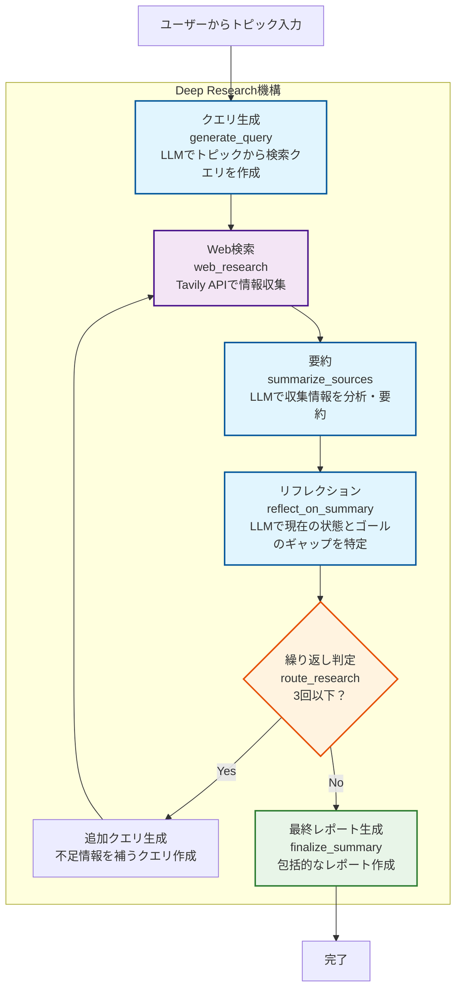

## はじめに
LLMの発展は目覚ましく、直近ではChatGPTやGeminiなどさまざまなLLMサービスでDeep Researchと呼ばれる複雑な調査を自律的に実行し、数百の情報源からデータを統合したレポートを生成することができるようになりました。
多くの製品では、情報源はWeb上の情報をソースとしますが、Microsoft 365 Copilotの「[リサーチャーエージェント](https://blogs.windows.com/japan/2025/04/14/researcher-agent-in-microsoft-365-copilot/)」機能では、Microsoft Graphを通じて組織内のドキュメントやメールなどに対してDeep Researchを行うことができます。

このようにDeep ResearchはWeb上のソースだけでなく自社の情報資産を活用して調査を行うこともできます。
同様に自社でLLMを組み込んだサービスを社内外向けに開発している開発者にとっても、そのサービスにDeep Researchを実装したい場面があると考えられます。

そこで今回はMicrosoftはGitHubにて公開しているDeep Researchのサンプルコードを理解することを目的に紐解いていきます。
また、併せてPythonで実装されている本家コードをC#で実装しなおしてみます。

https://github.com/Azure-Samples/deepresearch

ちなみにこのリポジトリはMicrosoftの年次フラグシップカンファレンスである[Microsoft Build 2025](https://news.microsoft.com/build-2025/)内でハンズオンラボのコンテンツとして使われたようです。

※これ以降特に注釈のない画像は、上記のGitHubリポジトリからの引用または著者が独自に作成したものです。

## リポジトリの全体像を理解する
注目すべき部分のみを抜き出していますが、以下がサンプルコードリポジトリの全体像です。

```
deepresearch/
├── app/ ----------------> メインのアプリケーションコードディレクトリ
│   ├── main.py ---------> エンドポイントや全体のオーケストレーションを担っている
│   ├── prompts.py ------> プロンプト一式が入っている定数ファイル
│   ├── states.py -------> 推論実行時の状態を管理するためのクラス
│   ├── formatting.py ---> 検索結果をフォーマットしてテキスト形式にするUtilクラス
│   ├── static/ ---------> JSやCSSなど、フロントエンドの静的ファイルディレクトリ
│   └── templates/
│       └── index.html --> UI用のHTML。特にSPAフレームワークなどは使っていない
└── infra/ --------------> azdコマンドでAzureリソースを作るためのBicepテンプレート
```

ここまでざっとリポジトリを俯瞰してみて、特筆すべきポイントは以下の通りです。
#### APIはFastAPIで実装
FastAPIを使用してAPIが実装されています。FastAPIはPythonでWeb APIを作る時は最近よくみるフレームワークです。

#### Web検索APIにはTavilyを使用
Web検索APIとしてTavilyを使用しています。
Tavilyは、Web検索APIを提供するサービスで、Webサイトに「Connect Your LLM　to the Web」とあるように、特にAIやLLMのアプリケーションでの利用が想定されています。

https://tavily.com

### LangGraphを使用した状態管理と遷移
LangGraphのStateGraphを使用した状態遷移グラフを構成し、クエリの生成やWeb検索などをノードとして定義しています。

https://zenn.dev/pharmax/articles/a9b9762c2c384e#langgraph%E3%81%AEstate%E3%81%AE%E5%9F%BA%E6%9C%AC%E7%9A%84%E3%81%AA%E4%BD%BF%E3%81%84%E6%96%B9

#### WebSocket通信を実装
Deep Researchは深い洞察を得るために、繰り返し検索と推論が行われます。それは高精度な結果を得ることができる一方で最終的な回答まで時間を要することがあります。そのため、WebSocket通信を使用して、クライアントに進捗状を通知する仕組みが実装されています。
WebSocket通信は、FastAPIの`WebSocket`クラスを使用して実装されています。

#### azd upコマンドに対応
Azure Developer CLI（azd）を使用して、Azureリソースを簡単に作成できるようになっています。
infraディレクトリにBicepテンプレートがあり、azd upコマンドでAzureリソースの作成とアプリのデプロイまでが完結します。

https://zenn.dev/microsoft/articles/59787e7a8fc2a9

## Deep Research機構を理解する
### 全体の流れを理解する
このリポジトリのDeep Research機構の流れは以下のようになっています。
1. クエリ生成：トピックに関して最適な検索クエリを生成
2. Web検索：Tavily APIを使用して複数の検索を行い情報を収集
3. 要約：AIが収集した情報を分析し要約
4. リフレクション：システムが知識のギャップを特定しさらなる調査を行う
5. 繰り返し：リフレクションの結果、追加の調査が必要であれば調査サイクルを繰り返し実施
6. レポート生成：画像を含んだ最終的かつ包括的なレポートを作成


### コードを理解する
リポジトリの全体像を踏まえると、基本的に`app/main.py`を見ればDeep Research機構で行なっている処理を理解できそうです。
以後、`main.py`のコードを中心にDeep Researchの機構を見ていきます。

### エンドポイント
エンドポイントは以下の2つが定義されています。
- `/`：クライアントファイルのHTMLとJSやCSSなどを返す。[Jinja2Templatesを使用してHTMLとJS/CSSをテンプレートとして返すようになっている。](https://github.com/Azure-Samples/deepresearch/blob/92dad3ba0ec27651a6858c5110482bfb25a7d15d/app/main.py#L38)
- `/we/{client_id}`：WebSocket通信を使ってDeep Resarchを実行すする。こっちがメイン。client_idは[クライアント側でランダムに生成している](https://github.com/Azure-Samples/deepresearch/blob/92dad3ba0ec27651a6858c5110482bfb25a7d15d/app/static/js/main.js#L60)

そのため、`/we/{client_id}`のエンドポイントの処理を確認すればよさそうです。このパスは`websocket_endpoint`関数にリンクされています。
この関数が実行されるとWS接続が確立されます。その後、[`setup_graph`関数](https://github.com/Azure-Samples/deepresearch/blob/92dad3ba0ec27651a6858c5110482bfb25a7d15d/app/main.py#L306)が呼び出され、Deep Researchの状態遷移グラフがセットアップされます。
`setup_graph`関数では、LangGraphのStateGraphを使用して、Deep Researchの各ステップ（クエリ生成、Web検索、要約、リフレクションなど）をノードとして定義しています。

```python
def setup_graph():
    # Add nodes and edges
    builder = StateGraph(SummaryState, input=SummaryStateInput, output=SummaryStateOutput)
    builder.add_node("generate_query", generate_query)
    builder.add_node("web_research", web_research)
    builder.add_node("summarize_sources", summarize_sources)
    builder.add_node("reflect_on_summary", reflect_on_summary)
    builder.add_node("finalize_summary", finalize_summary)
    
    # Add edges
    builder.add_edge(START, "generate_query")
    builder.add_edge("generate_query", "web_research")
    builder.add_edge("web_research", "summarize_sources")
    builder.add_edge("summarize_sources", "reflect_on_summary")
    builder.add_conditional_edges("reflect_on_summary", route_research)
    builder.add_edge("finalize_summary", END)
    
    return builder.compile()
```

ここで特筆すべきは`builder.add_conditional_edges("reflect_on_summary", route_research)`の部分です。これによってDeep Researchのリフレクションステップで、検索を繰り返すのか、最終的なレポートを生成するのかを条件分岐で制御しています。[`route_research`関数](https://github.com/Azure-Samples/deepresearch/blob/92dad3ba0ec27651a6858c5110482bfb25a7d15d/app/main.py#L287)がその条件分岐のロジックを実装しています。

```python
async def route_research(state: SummaryState):
    if state.research_loop_count <= 3:
        # ...省略
        return "web_research"
    else:
        # ...省略
        return "finalize_summary"
```

この処理から、Deep Researchのリフレクションステップで、3回までの繰り返し検索を行い、それ以降は最終的なレポートを生成することがわかります。

### 各ノード処理を理解する
ノードとして定義されている関数は以下の通りで、[全体の流れを理解する](###全体の流れを理解する)の流れをイメージすると大体名前から処理が想像できます。
- [generate_query](https://github.com/Azure-Samples/deepresearch/blob/92dad3ba0ec27651a6858c5110482bfb25a7d15d/app/main.py#L74)：ユーザー入力から検索クエリを作成する（LLM利用）
- [web_research](https://github.com/Azure-Samples/deepresearch/blob/92dad3ba0ec27651a6858c5110482bfb25a7d15d/app/main.py#L113)：Webを検索する
- [summarize_sources](https://github.com/Azure-Samples/deepresearch/blob/92dad3ba0ec27651a6858c5110482bfb25a7d15d/app/main.py#L145)：サマリーを生成する（LLM利用）
- [reflect_on_summary](https://github.com/Azure-Samples/deepresearch/blob/92dad3ba0ec27651a6858c5110482bfb25a7d15d/app/main.py#L194)：サマリーをリフレクションして不足している部分を補うためのクエリを生成（LLM利用）
- [finalize_summary](https://github.com/Azure-Samples/deepresearch/blob/92dad3ba0ec27651a6858c5110482bfb25a7d15d/app/main.py#L245)：ここまでの検索結果のサマリーを使って最終的なレポートを生成する。あくまで機械的に生成するだけでLLMは利用していない。

ノードの関数から呼ばれるUtil関数として[`strip_thinking_tokens`](https://github.com/Azure-Samples/deepresearch/blob/92dad3ba0ec27651a6858c5110482bfb25a7d15d/app/main.py#L59C5-L59C26)が`main.py`の中で定義されています。この関数は`generate_query`、`summarize_sources`、`reflect_on_summary`関数から呼び出されています。READMEやコードからこのアプリケーションは推論のLLMとして[Deep Seekのモデルを使用することが想定されている](https://github.com/Azure-Samples/deepresearch/blob/92dad3ba0ec27651a6858c5110482bfb25a7d15d/app/main.py#L50)ようです。Deep Seekの推論では思考過程を<think>~</think>というトークンで囲って出力されるため、そのトークンで囲まれた思考の文字列とそれ以外のユーザーへの回答の文字列を分離するためにこの関数が使用されています。

### プロンプトを読み解く
プロンプトは各ノードの関数でLLMを使用している3つ分のプロンプトが定義されています。
原文はもちろん英語ですが、ここでは理解を助けるために日本語訳で記載します。

##### [query_writer_instructions](https://github.com/Azure-Samples/deepresearch/blob/92dad3ba0ec27651a6858c5110482bfb25a7d15d/app/prompts.py#L7)：ユーザーからのトピックに関する情報をもとに、最適な検索クエリを生成するためのプロンプト
:::details query_writer_instructions プロンプト（日本語訳）
```
目標は、ターゲットを絞ったWeb検索クエリを生成することです。

<コンテキスト>
現在の日付: {current_date}
クエリには、この日付時点で入手可能な最新の情報が含まれていることを確認してください。
</コンテキスト>

<トピック>
{research_topic}
</トピック>

<フォーマット>
レスポンスは、以下の3つのキーをすべて含むJSONオブジェクトとしてフォーマットしてください。
- "query": 実際の検索クエリ文字列
- "rationale": このクエリが関連する理由の簡単な説明
</フォーマット>

<例>
出力例:
{{
"query": "machine learning transformer architecture explained",
"rationale": "Understanding the fundamentalstructure of transformer models"
}}
</例>

レスポンスはJSON形式で提供してください。タグやバッククォートは含めないでください。
例のように、JSONのみを返してください。
```
:::

ポイント
- いわゆるRAGのクエリ生成のステップと同じようなプロンプトですが、クエリを生成するだけでなく「なぜそのクエリを生成しているのか」という理由も説明させている。
- JSON形式での出力が求められていますが、JSON Modeなど構造を保証するオプションは使用されていないようです。そのためまれに不正なJSONが生成されることがあると考えられます。

##### [summarizer_instructions](https://github.com/Azure-Samples/deepresearch/blob/92dad3ba0ec27651a6858c5110482bfb25a7d15d/app/prompts.py#L35)：収集した情報を要約するためのプロンプト
:::details summarizer_instructions プロンプト（日本語訳）
```
<目標>
提供されたコンテキストに基づいて、質の高い要約を生成する。
</目標>

<要件>
新しい要約を作成する場合：
1. 検索結果から、ユーザーのトピックに最も関連性の高い情報を強調表示する。
2. 情報の流れが一貫していることを確認する。

既存の要約を拡張する場合：
1. 既存の要約と新しい検索結果を注意深く読む。
2. 新しい情報を既存の要約と比較する。
3. 新しい情報ごとに：
    a. 既存のポイントに関連する場合は、関連する段落に統合する。
    b. 全く新しい情報だが関連性がある場合は、スムーズな遷移を持つ新しい段落を追加する。
    c. ユーザーのトピックに関連しない場合は、その情報をスキップする。
4. すべての追加情報がユーザーのトピックに関連していることを確認する。
5. 最終的な出力が入力要約と異なることを確認する。
< /要件 >

< フォーマット >
- 序文やタイトルを付けずに、更新された要約から直接始めます。出力にはXMLタグを使用しないでください。
< /フォーマット >

<タスク>
まず、提供されたコンテキストについて慎重に検討します。次に、ユーザー入力に対応するコンテキストの要約を生成します。
</タスク>
```
:::

ポイント
- RAGの回答生成ステップと同じようなプロンプト
- 要約を生成する際に一貫性に注意する旨が記載されている。
- 既存の情報がすでに存在する場合はマージする

##### [reflection_instructions](https://github.com/Azure-Samples/deepresearch/blob/92dad3ba0ec27651a6858c5110482bfb25a7d15d/app/prompts.py#L65)：要約結果をもとに、さらなる調査が必要な場合のクエリを生成するためのプロンプト
:::details reflection_instructions プロンプト（日本語訳）
```
あなたは、{research_topic} に関する概要を分析する、専門のリサーチアシスタントです。

<GOAL>
1. 知識ギャップや、より深く掘り下げる必要がある領域を特定する。
2. 理解を深めるのに役立つフォローアップの質問を作成する。
3. 十分にカバーされていない技術的な詳細、実装の詳細、または新たなトレンドに焦点を当てる。
</GOAL>

<REQUIREMENTS>
フォローアップの質問が自己完結的であり、Web 検索に必要なコンテキストが含まれていることを確認する。
</REQUIREMENTS>

<FORMAT>
回答は、以下のキーを含む JSON オブジェクトとしてフォーマットしてください。
- knowledge_gap: 不足している情報、または明確化が必要な情報を記述する。
- follow_up_query: このギャップに対処するための具体的な質問を記述する。
</FORMAT>

<Task>
概要をよく検討し、知識ギャップを特定してフォローアップの質問を作成する。次に、次のJSON形式に従って出力を作成してください。
{{
"knowledge_gap": "概要にはパフォーマンス指標とベンチマークに関する情報が不足しています",
"follow_up_query": "[特定のテクノロジー]を評価するために使用される一般的なパフォーマンスベンチマークと指標は何ですか？"
}}
</Task>

分析結果はJSON形式で提供してください。タグやバッククォートは含めないでください。例のように、JSONのみを返してください。
```
:::

ポイント
- 現在まで収集した情報とゴールの間のギャップを確認し、より深く調べる必要がある領域を特定するためのプロンプトが用意されています。これはAzure OpenAIでいう[oシリーズ](https://learn.microsoft.com/ja-jp/azure/ai-foundry/openai/concepts/models?tabs=global-standard%2Cstandard-chat-completions#o-series-models)のような推論モデルが得意とする分野のように思えます。

- JSON形式での出力が求められていますが、JSON Modeなど構造を保証するオプションは使用されていないようです。そのためまれに不正なJSONが生成されることがあると考えられます。

## まとめと改善と発展
Deep Researchの機構に注目すると以下のような流れで構成されています。


こうしてみるとDeep Researchの機構はそこまで複雑ではなく、LLMによって計画とリフレクションが自律的に行われるシンプルな機構であることがわかります。
また、クエリの生成とその検索結果からのサマリーの作成についてのプロンプトは、Deep Researchを実現しない単純なRAGでも参考になりそうな内容でした。


一方で、ハンズオンコンテンツゆえのあえての簡略化だと思われますが、以下の様な改善点も発見できました。
- リフレクション機構の改善
現在は固定値で3回までの繰り返し検索を行うようになっていますが、ゴールの判定自体もLLMが行うことにより、より確実かつ柔軟な調査が可能になると考えられます。

- Deep Seek以外のモデルへの対応
おそらくAzureを利用するユーザーの多くは企業やエンタープライズ系の組織が多く、今回のDeep SeekのようなサードパーティやOSSのモデルではなくAzure OpenAIの様な商用モデルを利用することが多いと考えられます。そのため、Azure OpenAIのモデルへの対応ニーズがありそうです。また次の「構造化オプションの利用」にもそれが関係してきます。

- 構造化オプションの利用
現在は、Deep Researchの結果をテキスト形式で出力していますが、JSON Modeなど構造化されたデータ形式（例えばJSONやXML）で出力することで確実なアプリケーションへの組み込みが期待できます。ただし、JSON Modeは、AzureではAzure OpenAI Serviceの機能として提供されているため、Azure OpenAI Serviceを利用する必要があります。

- 各ステップにおけるモデルの使い分け
クエリの生成やリフレクションはモデルによって結果が大きく変わりそうですが、要約ステップはいわゆる従来からのRAGの回答生成に相当するため、経験上比較的軽量かつ安価なモデルを使用しても良いかもしれません。例えば、前者にはo4-mini、後者はGPT-4oなど。


## C#で実装しなおす
著者はC#を使用することが多いため、今後の持ち駒としてC#でDeep Researchの機構を実装しなおしてみます。
基本的には本記事で紹介したサンプルリポジトリの機構を再現しつつも、前述した改善点を踏まえた以下のような実装を目指します。

- LangGraphはC#ではサポートされていないため、状態遷移を独自に実装する。
- LLMは各ステップにおいて、Azure OpenAI Serviceのモデルを使い分ける。
  - クエリ生成とリフレクション：o4-mini
  - 要約：GPT-4o
- Azure OpenAI ServiceのJSON Modeを使用して、構造化されたデータ形式で出力する。
- リフレクションステップのゴール判定をLLMに行わせる。
